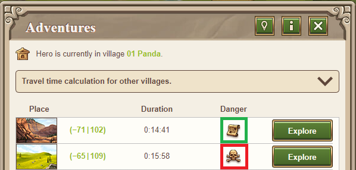

# Adventures

> Source: Travian: Legends Support  
> URL: https://support.travian.com/en/articles/46-adventures

---

Adventures act as a simple quest system for your hero. There are no tasks to complete inside an adventure—your hero only needs to **travel to the adventure location** shown on the map. Once the hero arrives, it explores the spot and then automatically returns to the village if it survives.

You can see available adventures on the map and in the **hero panel**, where a full list is shown.

## **How Adventures Spawn**

Adventures appear randomly around:

- Your **capital**
- Any village that has a **Hero’s Mansion**

They do **not** depend on the hero’s home village or the hero’s current location.

---

## **Adventure Difficulty and Damage**

Adventure difficulty increases gradually. Before sending your hero, you always see whether an adventure is **Normal** or **Heavy**:

- **Normal adventures:** low damage, low experience
- **Heavy adventures:** higher damage, double experience

A fully healthy hero (100% health) usually survives heavy adventures.

Adventure **location type** (oasis, wilderness, Natarian village, mountains, etc.) has **no impact** on damage.

You can reduce the damage your hero takes by increasing its **fighting strength**, either by:

- Equipping items that boost fighting strength
- Spending skill points on fighting strength when leveling up

## **Adventure Rewards**

Your hero can find several types of rewards:

- Nothing (only damage and experience)
- Items (armor, weapons, equipment)
- Silver
- Resources (stored in the hero’s inventory)
- Scattered troops (they join your village)

The **first 10 adventures** always give fixed rewards in this order:

1. Horse
2. Resources
3. Units
4. Silver
5. Ointment
6. Book of Wisdom
7. Resources
8. Silver
9. Cages
10. Experience only

After the first 10, reward outcomes are random for all players, and everyone has equal chances regardless of avatar size. Resources are the most common reward, while items are rarer.

Items found early in the game are always **tier 1**. As the gameworld ages, **tier 2** and **tier 3** items begin to appear.

Adventures never expire, but their rewards depend on **when they were created**. If an adventure spawned before tier 2 items were available, it will not contain tier 2 even if completed later.

- [Hero Item Overview and Mounts](https://support.travian.com/articles/89)
- [Game versions and speed](https://support.travian.com/articles/20)

---

## **Adventure Spawn Rate**

At the start of the game, every player begins with **3 adventures**.

More adventures appear regularly, though the rate decreases over time. On a normal x1 server:

- Days 0–2: ~3 per day
- Days 3–16: ~2 per day
- Days 17–63: ~1.5 per day
- Day 64 onward: ~1 per day

During the first 24 hours, this results in approximately **5–6 total adventures**.

There is natural randomness, so some days may generate fewer or none. Saving one adventure from a previous day helps with daily task completion.

Spawn rates scale with server speed. For example, on a x3 gameworld:

- Day 0: 9 per day
- Days 1–5.33: 6 per day
- Days 5.33–21: ~4.5 per day
- Day 21 onward: 3 per day
