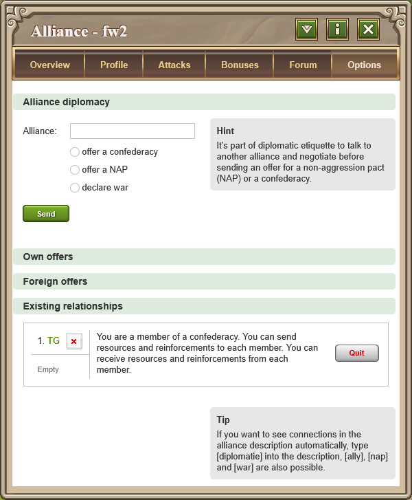
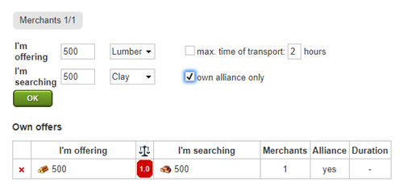

# Alliance, Confed & NAP

> Source: Travian: Legends Support  
> URL: https://support.travian.com/en/articles/84-alliance-confed-and-nap

---

**Travian: Legends** is built on cooperation and diplomacy. Joining or leading an **alliance** allows players to coordinate attacks, defenses, and resource sharing — all crucial to victory in the endgame.

---

### What Is an Alliance?

An **alliance** is a group of up to **60 players** working together.
Alliances can share intelligence, reinforce one another, trade resources, and compete for **artefacts** that grant powerful bonuses.

| Action | **Requirement** |
| --- | --- |
| **Create an Alliance** | Embassy level **3** |
| **Join an Alliance** | Embassy level **1** |

> If the Embassy is destroyed, the alliance remains intact — no members are removed.

Alliances can form larger partnerships known as **confederacies**, or choose **non-aggression pacts (NAPs)** to establish peace with others.

---

### Confederacies

A **confederacy** is a formal cooperation agreement between **up to three alliances**.
Members of a confederacy can:

- Send **resources and reinforcements** to one another.
- Plan **joint attacks** and **shared defenses**.
- Coordinate against common enemies.

Confederacies must be **interconnected**, meaning all alliances are directly linked — not just indirectly through others.

> Only alliances in the **same confederacy** can exchange resources and reinforcements.
> NAPs are **not** affected by these restrictions.

---

### How to Create a Confederacy

1. **Alliance A** sends a **confederacy offer** to another alliance (e.g., Alliance B).
2. If **Alliance B** accepts, the confederacy is formed.
3. To add a **third alliance (Alliance C)**:

	- One existing alliance sends the offer to Alliance C.
	- The other alliance(s) in the confederacy must approve it.
	- Alliance C then accepts to finalize the addition.

Any alliance can **leave** a confederacy at any time.
An alliance can also be **removed**, but only if **all remaining confederacy members agree**.

---

**Example: Alliance Diplomacy Screen**

This menu allows leaders to:

- Offer a **confederacy** or **NAP**,
- Declare **war**,
- Manage **existing relationships** (listed below).

> **Tip:**
> In your alliance description, you can automatically display connections by using tags like `[diplomatic]`, `[ally]`, `[nap]`, or `[war]`.

---

### Sending Reinforcements and Resources

You can only send **resources or reinforcements** to:

- Your own villages
- Members of your **alliance**
- Members of your **confederacy**

The **Marketplace** remains open to all players, but you can restrict offers to alliance members using the **“own alliance only”** checkbox.

**Example:**

---

### Leaving an Alliance or Confederacy

When a connection that allows reinforcement or resource exchange is broken (for example, a player leaves an alliance, or an alliance leaves a confederacy):

1. **New resources cannot be sent** to villages outside the alliance or confederacy.
2. **Merchants already en route** will still deliver their cargo.
3. **New reinforcements** cannot be sent.
4. A **1-hour timer** starts.

After one hour:

- The system checks all active memberships.
- Any reinforcements from players **no longer in the same alliance or confederacy** are **automatically returned**.
- Reinforcements still traveling when the timer ends will return **immediately upon arrival**.

If a player **rejoins or leaves again**, a **new 1-hour timer** starts.

---

### Non-Aggression Pacts (NAPs)

A **Non-Aggression Pact (NAP)** is a diplomatic agreement where two alliances agree **not to attack each other**. However, unlike confederacies, NAPs **do not allow** resource or troop sharing.

They are often used by strong alliances to **avoid mutual damage** while focusing on other fronts.
Each alliance may hold **up to three NAPs** at a time.

---

### War

A **war** is a declared state of hostility between alliances.
Confederacy members typically **support each other** during wars by reinforcing and sharing strategy.

---

### Summary

| **Diplomatic Type** | **Maximum Members** | **Allows Resources or****Reinforcements** | **Typical Purpose** |
| --- | --- | --- | --- |
| **Alliance** | 60 players | Yes (within alliance) | Cooperative play |
| **Confederacy** | 3 alliances | Yes | Joint defense & coordination |
| **NAP** | 3 per alliance | No | Peace & neutrality |
| **War** | Unlimited | No | Active hostility |

---

### Tips

- Form **confederacies** with trusted alliances to share defense and resources effectively.
- Use **NAPs** for short-term peace, but be prepared — they don’t guarantee long-term cooperation.
- Monitor alliance changes: when confederacy links break, reinforcement recalls begin automatically.
