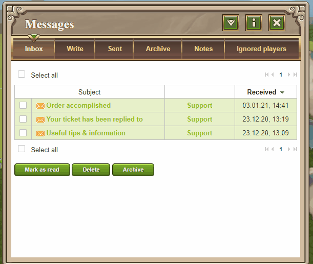
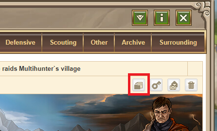

# Archive reports and messages

> Source: Travian: Legends Support  
> URL: https://support.travian.com/en/articles/59-archive-reports-and-messages

---

The ability to **archive reports and messages** is a **Gold Club feature**([Gold Club](https://support.travian.com/articles/128)).
It allows you to keep important information safe, even when older reports or messages are automatically deleted.

You can archive **any report or message** that has not been deleted.
There is **no limit** to the number of reports or messages you can archive.

---

### How to Archive a Report or Message

1. Go to the **Reports** or **Messages** overview.
2. Tick the **checkbox** next to the report or message you want to save.
3. Scroll down and click the **“Archive”** button.

You can then find all saved reports and messages under the **“Archive”** tab in the same section.

---

### Archiving Directly from a Report

You can also archive a report **directly from its detail view**. Simply click the **archive button** at the top of the report window.

