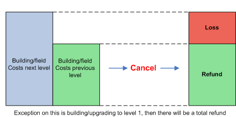

# Canceling Actions

> Source: Travian: Legends Support  
> URL: https://support.travian.com/en/articles/19-canceling-actions

---

In Travian: Legends, some actions can be **canceled**, while others are **permanent** once started. Understanding what you can undo — and what you can’t — helps you avoid costly mistakes.

---

## How to Cancel an Action

Look for the **red cross (****)** next to an active order. Clicking it will cancel the action.

---

## Canceling Building Orders or Upgrades

If you cancel a **building** or **field upgrade**, part of the resources you invested will be lost.
This loss exists to prevent players from abusing the system to hide resources during attacks.

The **exception** is when upgrading a building or field to **level 1** — in that case, you’ll receive a **full refund**.

*(The chart below visually explains this: the difference between the cost for the new level and the current level represents the lost resources.)*

---

## Canceling Troop Movements

You can cancel troops that have just been sent — whether they’re on a **raid**, **attack**, or sent as **reinforcements**.

- Cancellations are only possible within the **first 90 seconds** after sending.
- To cancel, open your **Rally Point** and click the **red cross (****)** next to the outgoing troops.

---

## Actions That Cannot Be Canceled

The following actions are permanent once started:

- Research in the **Academy** or **Smithy**
- **Marketplace** trades and merchant deliveries
- **Troop training**
- **Celebrations** in the Town Hall
- **Bids** placed in the Auction House

---

## Why Some Actions Can’t Be Canceled

These restrictions exist to prevent players from using cancelable actions to **hide resources**, effectively turning them into an additional “cranny” during attacks.

---

**Tip:** Before confirming any action, especially troop training or trade offers, double-check the details — once it’s in motion, it’s usually final!

