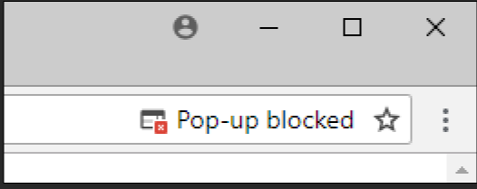
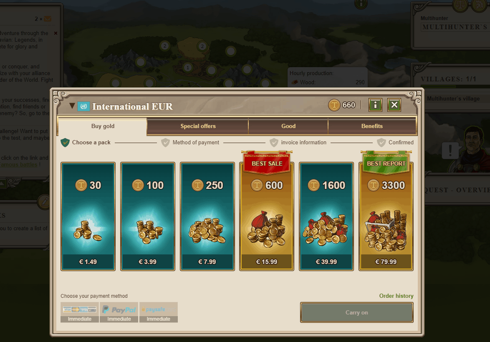

# Cannot Start Purchase

> Source: Travian: Legends Support  
> URL: https://support.travian.com/en/articles/113-cannot-start-purchase

---

When you make a purchase in the gold store, the payment window opens in a new tab or window (see video at bottom of page). If it window does not appear, the reason might be your browser blocking pop-ups.

An error or icon may show in the browser bar, click it to find more options and allow the pop-ups.

If the icon does not show follow the detailed instructions for all major browsers:

- [Microsoft Edge: Enable Popups Guide](https://support.microsoft.com/en-us/microsoft-edge/block-pop-ups-in-microsoft-edge-1d8ba4f8-f385-9a0b-e944-aa47339b6bb5) (External Link)
- [Google Chrome: Enable Popups Guide (External Link)](https://support.google.com/chrome/answer/95472?co=GENIE.Platform%3DDesktop&hl=en)
- [Firefox: Enable Popups Guide (External Link)](https://support.mozilla.org/en-US/kb/pop-blocker-settings-exceptions-troubleshooting#firefox:win11:fx95)
- [Apple Safari: Enable Popups Guide (External Link)](https://support.apple.com/en-gb/HT203987)

