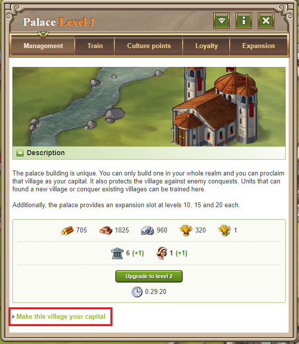
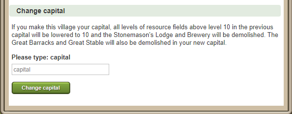

# Capital Village

> Source: Travian: Legends Support  
> URL: https://support.travian.com/en/articles/50-capital-village

---

### What makes the capital special?

Your **capital** is the most important village in your empire. Here’s what makes it unique:

- **It can never be conquered** by another player.
- **Great Barracks** and **Great Stable** **cannot** be built there.
- You can build a **Stonemason’s Lodge**, which increases building durability by up to **300%**.
- **Resource fields** can be upgraded **beyond level 10**, without limit (in theory).

---

### How to choose or change your capital

Your **first village** automatically starts as your capital.
To change it later:

1. Build a **Palace** in the village you want to make your new capital.
2. Upgrade the Palace to **level 1**.
3. Click **“Make this village your capital”** in the Palace menu.
4. Type **capital** (in English or your selected in-game language) and confirm by clicking the green button.

> *You can only have one Palace at a time.*
> If you want to move your capital again later, demolish your current Palace and rebuild it in another village.

---

### Restrictions

- Villages that **contain a Wonder of the World** cannot become a capital. The Palace can still be built, but the **“Make this village your capital”** option will be greyed out.
- If your Palace is destroyed, the **village remains your capital** until you choose to change it.

---

### What happens when you change your capital?

Be cautious — this change is **permanent** and **cannot be undone**.

When you switch capitals:

- All **resource fields above level 10** in the **old capital** are reduced back to level 10.
- The **Stonemason’s Lodge** and, for Teutons, the **Brewery**, are destroyed.
- If your new capital has **Great Barracks** or **Great Stable**, those will be removed as well.

Once changed, you can safely demolish the Palace if you wish.

**Warning:** There is **no way to reverse** this change!

---

### If your capital is destroyed

If your capital is completely destroyed, your **largest remaining village** with a **Residence, Palace, or Command Center** automatically becomes your new capital.

---

### How to identify an enemy’s capital

In the **player overview**, look for the **(capital)** tag — this marks which of their villages is the capital.
