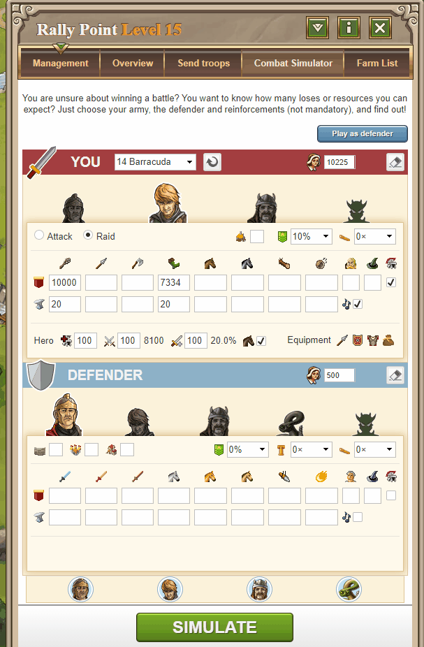

# Combat Simulator

> Source: Travian: Legends Support  
> URL: https://support.travian.com/en/articles/18-combat-simulator

---

The **Combat Simulator** helps you plan and predict the outcome of battles. By entering the details of your attacking and defending armies, you can simulate how a real fight might unfold and use that information to prepare your strategy.

---

## What the Simulator Does

The simulator estimates the **most likely outcome** of a battle based on the information you provide.

It’s not 100% precise — many factors influence real combat — but it gives a **reliable approximation** you can use to:

- Adjust troop numbers before attacking.
- See how upgrades (e.g. Smithy levels) affect combat strength.
- Experiment with different unit combinations to find weaknesses in your opponent’s setup.
- Plan defensive reinforcements more effectively.

---

## Using the Combat Simulator

You can find the simulator in your **Rally Point** under the **“Combat Simulator”** tab.

1. Choose whether you’re simulating an **attack** or a **raid**.
2. Enter the number and type of troops for both attacker and defender.
3. (Optional) Add reinforcements or hero bonuses.
4. Click **Simulate** to see the result.

---

## Remember

There are thousands of possible variations depending on the tribes and unit types involved. Use the simulator as a **planning tool**, not an exact prediction — it’s most effective for spotting potential losses or for testing “what-if” scenarios before committing to a real battle.

---

**Tip:** Always run a quick simulation before sending a major attack. A few seconds of preparation can save your army and resources.

