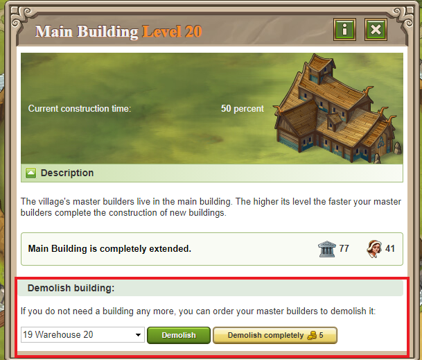

# Demolishing Buildings

> Source: Travian: Legends Support  
> URL: https://support.travian.com/en/articles/39-demolishing-buildings

---

If you no longer need a building, you can **order your builders to demolish it** from the **Main Building**.
To do so, your **Main Building must be at least level 10**.

---

## How to Demolish a Building

Inside your **Main Building**, you have three options:

1. **Demolish level by level** – normal destruction speed (takes time).
2. **Instantly complete the current demolition** using the
> [Finish constructions and research orders](https://support.travian.com/articles/36).
3. **Demolish the entire building at once** using the **Gold instant complete destruction** option.

## Alternative Methods

- You can also **use catapults** to demolish buildings in your **own village**.
- Or ask a **friend, ally, or nearby player** to **attack your village with catapults** — a faster (and cheaper) way to clear space.

---

**Tip:**
Demolishing buildings is useful when you want to **restructure your village layout** or **free up space** for new, more advanced buildings.
