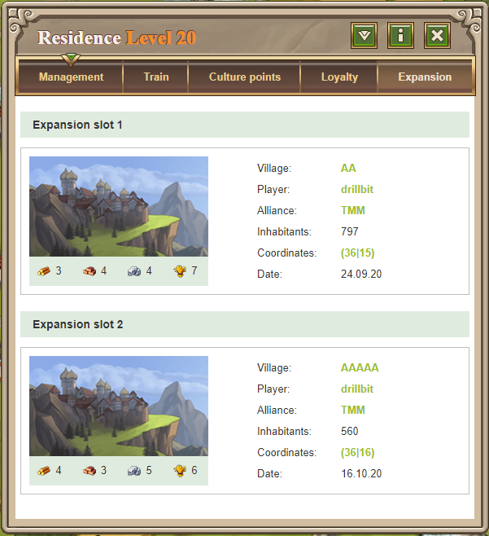
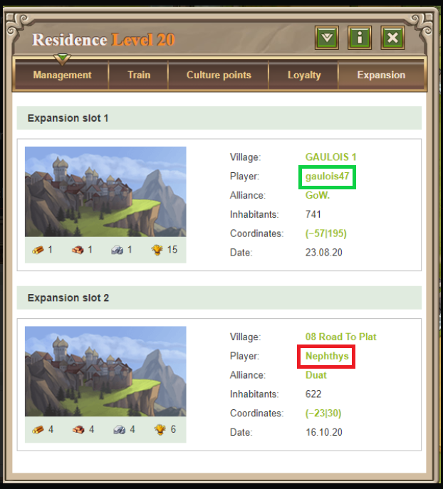

# Expansion Slots

> Source: Travian: Legends Support  
> URL: https://support.travian.com/en/articles/52-expansion-slots

---

### What are Expansion Slots?

To **found** or **conquer** a new village, you need a **free expansion slot**.

You can check if your village still has an available slot by:

1. Opening your **Residence**, **Palace**, or **Command Center**.
2. Selecting the **“Expansion”** tab.

Each village has a fixed number of expansion slots:

- **Residence** → 2 slots
- **Palace / Command Center** → 3 slots

> Each village’s slots are unique to that village — they don’t transfer if you lose or destroy it.

---

### What happens when you conquer a village?

If you **conquer a village** that already used one or more of its expansion slots, you inherit its status.

For example:

- If the **previous owner** already founded 1, 2, or 3 villages from that settlement, those slots remain **used**, even after you take control.
- This means you can only use the **remaining** free slots (if any).

---

### What this means for you

If you capture a village:

- A **Residence (level 20)** gives you up to **2 slots**, but one may already be used.
- A **Palace (level 15 or 20)** gives you **3 slots**, though some may be taken.

You can only found or conquer as many villages as there are **free expansion slots** remaining.

---

### How to free up used slots

If a slot is already used and you want to reuse it, you can free it by:

- **Destroying the village** that was founded from it,
- **Conquering** that same village yourself from another of your own villages, or
- Waiting for the **player who owns that village to delete their account**.
