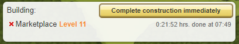

# Finish constructions and research orders

> Source: Travian: Legends Support  
> URL: https://support.travian.com/en/articles/36-finish-constructions-and-research-orders

---

You can instantly finish ongoing **construction** and **research** in a village by spending Gold.

When a building upgrade or research task is already in progress, a Gold button appears. Selecting **“complete construction immediately”** opens a confirmation window. After confirming, **all ongoing constructions and all research in that village finish instantly**. The cost for instant completion is **2 Gold**.

Keep in mind that this feature applies **only** to construction and research. It **does not** affect:

- Celebrations
- Buildings in the **Master Builder** queue
- Troop training

---

## **Exceptions**

For gameplay reasons, instant finish **cannot** be used on:

- **Residence**
- **Palace**
- **Command Center**
- **World Wonder villages**
- The **World Wonder** itself

