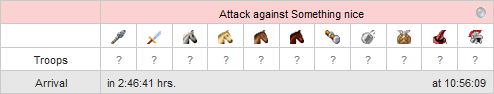
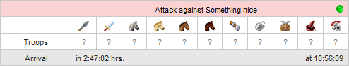
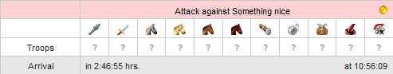
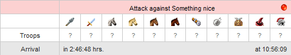

# Flagging of attacks

> Source: Travian: Legends Support  
> URL: https://support.travian.com/en/articles/68-flagging-of-attacks

---

Flagging attacks is a **premium feature** that lets you mark incoming attacks with colored balls. This helps you organize and prioritize threats—for example, marking dangerous attacks in **red**. In addition, attacks flagged with the **green ball** will **not** show the usual incoming attack warning (red swords) in the village list.

- [Incoming attack warning in village list](https://support.travian.com/articles/70)

---

## **How to Change the Flag Color**

Next to every incoming attack, you will see a **grey ball**.
Clicking it cycles through different colors:

1. **Grey** (default)
2. **Green**
3. **Yellow**
4. **Red**
5. Back to **Grey**

You can click as many times as you like until the attack is marked with the color you want.

This allows you to visually organize attacks based on urgency or priority.

