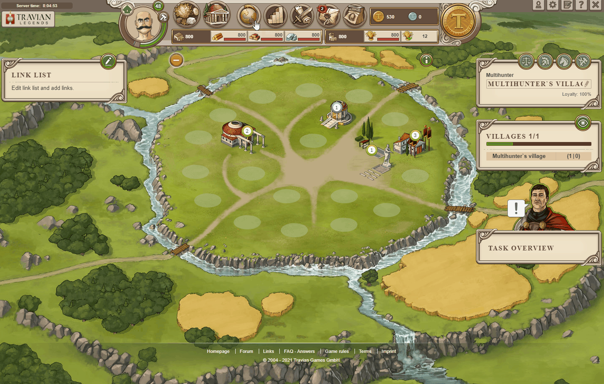

# Gold Club: Crop Finder

> Source: Travian: Legends Support  
> URL: https://support.travian.com/en/articles/53-gold-club-crop-finder

---

### What is the Crop Finder?

The **Crop Finder** is a **Gold Club** feature that helps you locate the best crop villages on the map.
With it, you can quickly find:

- **15-crop villages**
- **9-crop villages**
and see which **oases** are nearby.

> This tool is available only to players who have activated the [**Gold club features**](https://support.travian.com/en/support/solutions/articles/7000061561-available-gold-plus-gold-club-features).

---

### How to use the Crop Finder

1. Open the **map view**.
2. Click the **crop icon** (?).
3. Enter your **desired coordinates** and **village search range**.
4. View the results — the tool will display all matching villages and nearby oases.

