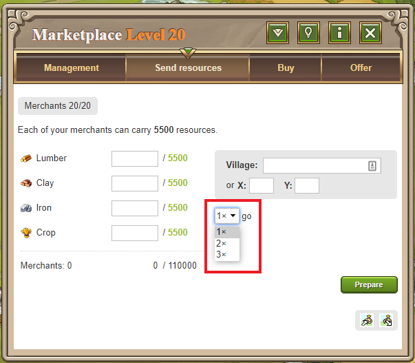

# Gold Club: Merchants run three times

> Source: Travian: Legends Support  
> URL: https://support.travian.com/en/articles/132-gold-club-merchants-run-three-times

---

The **Merchants Run Three Times** feature is part of the [Gold Club](https://support.travian.com/articles/128). It allows your merchants to automatically make **up to three consecutive trips** to the same target village with the same amount of resources.

---

### How to Use

1. Go to your **Marketplace** and open the **Send Resources** tab.
2. Enter the amount of resources and the destination village coordinates.
3. Below the coordinates, select **“3×”** from the dropdown menu.
4. Your merchants will then deliver the same load **three times in a row** automatically.

---

### Tip

This feature is especially useful for players managing several villages or trading large amounts of resources regularly. It saves time and helps maintain consistent resource transfers without repeating manual steps.
