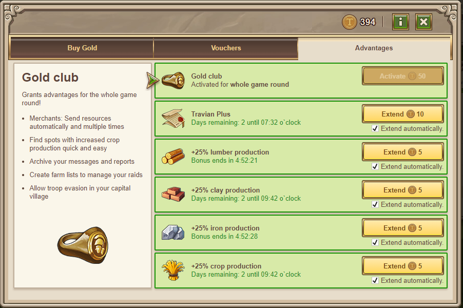

# Gold Club Overview

> Source: Travian: Legends Support  
> URL: https://support.travian.com/en/articles/128-gold-club-overview

---

The **Gold Club** offers exclusive, unlimited features that help you manage your account more efficiently throughout the entire game world.

---

### Activation and Duration

You can purchase **Gold Club membership for 200 Gold**.
Once activated, it lasts for the **whole duration of the game round** and does **not** need renewal.

> **Important:** Gold spent on the Gold Club is **non-refundable**, even if your avatar is deleted or the game world ends.

---

### Gold Club Features

All features below are included automatically and can be used without limits for the rest of the round:

- [Archive messages and reports](https://support.travian.com/articles/59) – Organize your messages and battle reports for easy reference.
- [Crop finder](https://support.travian.com/articles/53) – Quickly locate villages with high crop fields on the map.
- [Farm list](https://support.travian.com/articles/69) – Send out multiple raids efficiently from your rally point.
- [Trade Routes](https://support.travian.com/articles/60) – Schedule automatic resource deliveries between your own villages.
- [Troop Evasion](https://support.travian.com/articles/15) – Send troops away from your capital before an incoming attack to protect them.
- [Merchants run three times](https://support.travian.com/articles/132) – Each merchant can complete up to three trips per trade order.

---

### Tip

Gold Club is ideal for active players who manage multiple villages or send frequent raids.
It combines convenience, safety, and automation—helping you save time while staying competitive.

