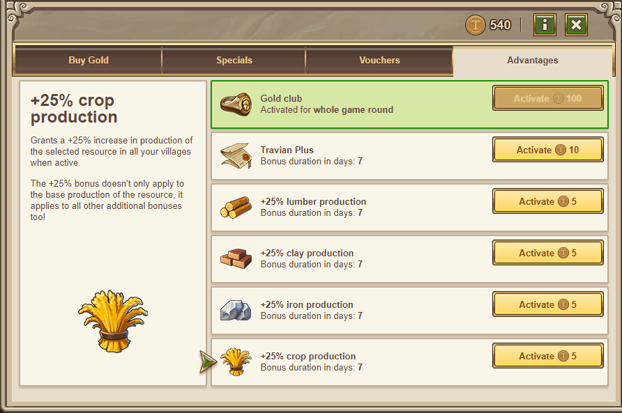
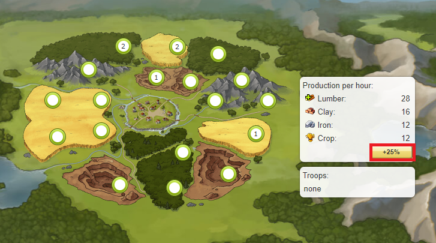

# Gold Feature: Production Bonuses

> Source: Travian: Legends Support  
> URL: https://support.travian.com/en/articles/129-gold-feature-production-bonuses

---

**Production bonuses** are premium features that temporarily boost your resource output.
They can be found in the **Gold Store** under the **Advantages** tab.

---

### Activation and Duration

Each production bonus costs **5 Gold** and increases the selected resource’s production by **25%**.

The duration depends on the server speed:

- **7 days** on **1x speed servers**
- **3 days** on **3x speed servers**

Once activated, you can also enable the **auto-extend** option to renew the bonus automatically when it expires.

You can purchase these bonuses directly from the **Gold Store** or from your **Village Overview**.

---

### Available Bonuses

You can activate a **25% bonus** for each resource type:

- Lumber
- Clay
- Iron
- Crop

The +25% boost applies to the **total production** of the selected resource, not just the base rate.

