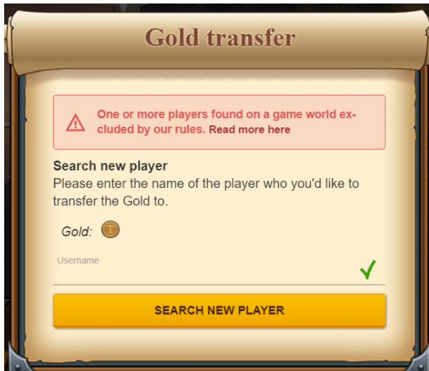

# Gold Transfer

> Source: Travian: Legends Support  
> URL: https://support.travian.com/en/articles/117-gold-transfer

---

#### What Is Gold Transfer?

When your **gameworld ends** or you **delete your avatar**, you can transfer any **unused purchased Gold** to another gameworld. After the round ends or your avatar is deleted, you’ll receive an **email with a Gold Transfer Link** and detailed instructions.

---

### How Much Gold Can Be Transferred?

When the transfer becomes available, the system:

1. Converts the **remaining time** on your **Travian Plus** and **resource bonuses** back into Gold.
2. Compares:

	- The **total Gold left** on your avatar, and
	- The **amount of purchased, transferable Gold** from that round.

You can transfer **the lower of these two values** — meaning:

> You can transfer as much Gold as you have at the end, but not more than the amount of purchased Gold in that round.

**Not transferable:**

- **Gold Starter Promo**- Gold from this special one-time offer package is not transferable (see [Game Rule 1.8](https://www.travian.com/gamerules))
- **Free Gold** earned from starter rewards or task quests.

---

### Where Can I Transfer My Gold?

In most cases, you can transfer Gold from **any gameworld to any other**, regardless of region.
However, some worlds have **restrictions**, such as:

- **Special servers or tournaments**
- **Gameworlds that don’t accept or generate transfer links**

These exceptions are always listed in the **server announcement** when applicable.

---

### Common Transfer Restrictions

If you see a message like

> *“One or more players found on a game world excluded by our rules.”*

it means the system found your target nickname, but on a world where Gold cannot be transferred.
You can still use the link to transfer your Gold to a **different gameworld**.

**Transfers are restricted in these cases:**

- **Tournament servers:** Only Gold from **previous tournament rounds** can be transferred in.
- **PTR servers:** Only Gold from **other PTR servers** can be transferred (both directions).
- **Alpler servers:** Because of the **lower price in Lira**, Gold can only be transferred **to or from other Alpler servers**.

---

### How to Transfer Gold

You can transfer Gold only **after a round ends** or **once your avatar deletion completes**:

1. Open your **Account Deletion** page in-game to see how much Gold can be transferred.
2. If you recently purchased Gold, there may be a **short delay** before deletion becomes available (for security reasons).
3. Once your avatar is deleted, you’ll receive a **Gold Transfer email** at your registered address.
4. Follow the link in that email and the on-screen instructions to complete the transfer.

> The transfer link **does not expire** until the Gold is used.
> You can safely store it and use it later, for example when a new round of the same world starts.

---

### Important Notes

- **Customer Service cannot speed up avatar deletions**.
- **Transfer emails** may go to *Spam*, *Trash*, or *Promotions* folders — check those first.
- If you **lose your transfer link**, Customer Service can only recreate it for a **limited time**. If several months pass, recovery might not be possible.
