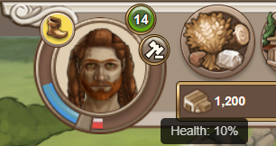
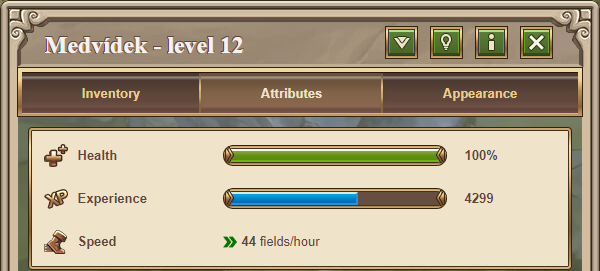
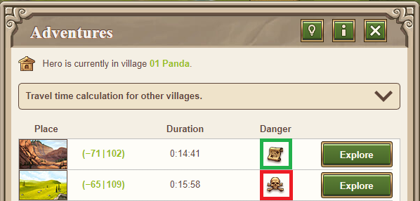
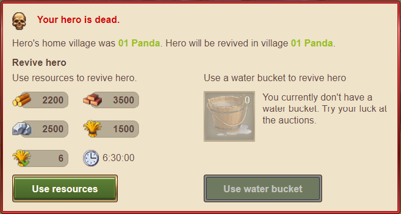

# Hero Health and Revival

> Source: Travian: Legends Support  
> URL: https://support.travian.com/en/articles/47-hero-health-and-revival

---

Your hero’s **health (HP)** is important for survival. They lose health during adventures, in battles, when there is not enough crop to feed them, or when they accumulate too much damage. You can view your hero’s current health in the **hero overview** (top left) and on the **hero attributes** page.

---

## **Losing Health**

### **Adventures**

Your hero always loses health when completing adventures. The amount depends on:

- The hero’s **Fighting Strength**
- The **difficulty** of the adventure
- How many adventures the hero has completed before

Adventures become harder over time, and without increasing Fighting Strength, your hero will begin losing larger amounts of health per adventure.

### **Combat**

Your hero also loses health in battles. The loss depends on the total strength of both attacking and defending sides. While battle reports do not show hero health loss directly, you can estimate it by looking at the percentage of friendly troops killed.

Additional notes:

- If a hero loses **90% or more health** in a single battle, they die.
- A hero may take damage even when attacking a village with **no defending troops**.
- A hero always fights at **full strength**, regardless of their current HP. Low HP only increases the risk of dying.
- If the hero’s home village is **destroyed or conquered**, the hero dies.

---

## **Healing Your Hero**

There are three ways to restore hero health:

### **1. Regeneration**

- Default regeneration is **10% health per day**.
- Regeneration can be increased with specific **hero health items** (helmets, armor, etc.).

	- [Hero Items Overview and Mounts](https://support.travian.com/articles/89)

### **2. Ointments**

- Instantly restore health when used.
- Found as adventure rewards or purchased via auctions.
- Use them from the hero inventory.

	- [Hero Consumables](https://support.travian.com/articles/90)
- Each Ointment heals **1%**.

### **3. Level Up**

- When a hero levels up, they are **fully healed**.
- If the hero dies and levels up at the same time, they are **not revived** by the level up.

---

## **Reviving Your Hero**

If your hero dies, there are two revival options:

### **1. Revive with Resources**

You can revive the hero from the **hero attributes** page.
The cost and time depend on the hero’s **tribe** and **level**.

### **2. Use a Bucket**

- A **Bucket** instantly revives the hero.
- Buckets are adventure rewards or auction items.
- Can only be used **once every 24 hours**, but you can own any number of buckets.

---

## **Revival Time Formula**

### **Below Level 99**

Revival time is calculated as:

**revival time = (hero level + 1, but not more than 24) divided by (game world speed / 3 + 1, rounded down)**
Result is measured in **hours**.

Maximum revival time is **24 hours**.
Example for hero level 5 on x2 game world speed: (5+1) / (2/3+1, rounded down) = 6 / 1 = 6 hours

### **Level 99 and Above**

Higher levels reduce revival time further:

**revival time = 24 hours × (99 / (99 + (hero level – 99) × 5))**

Example:
At level 100 → approximately **22.8 hours**.
