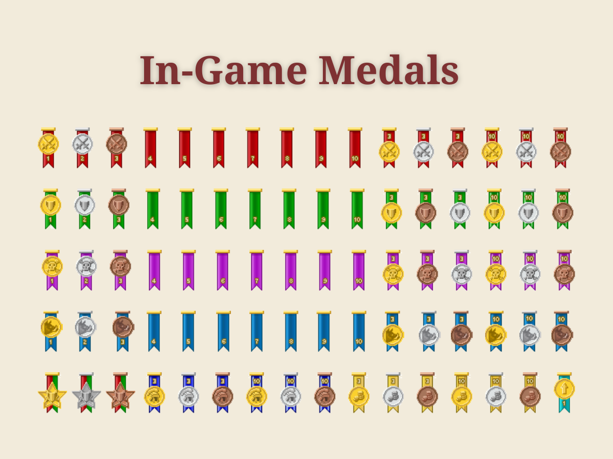
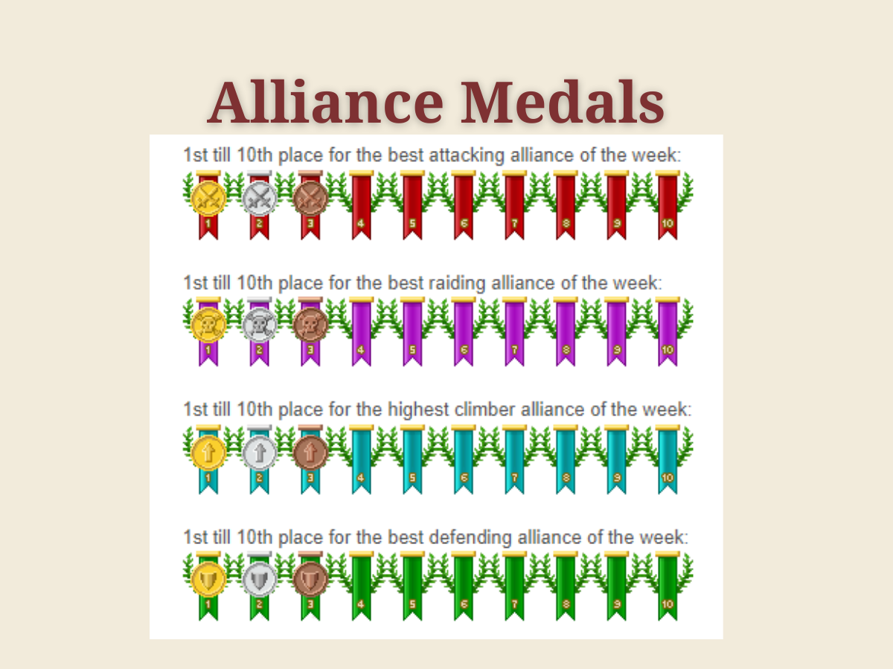
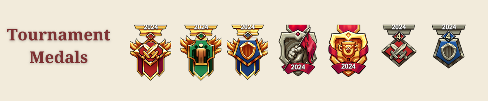
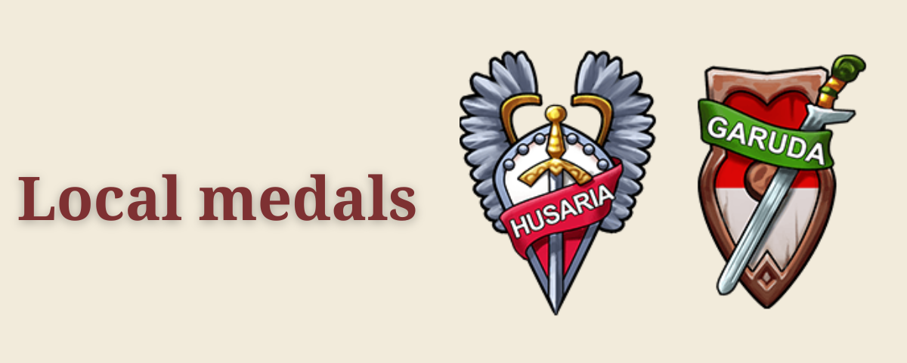
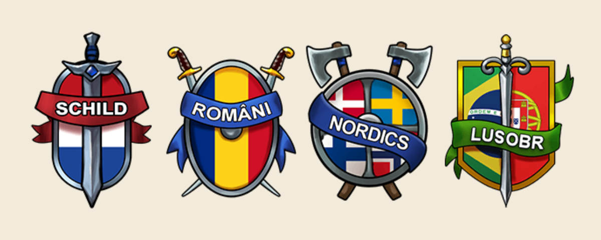
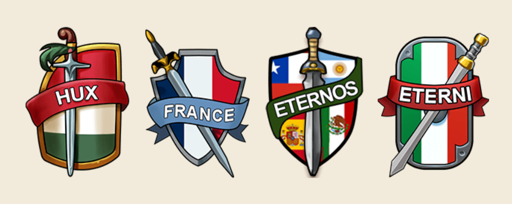
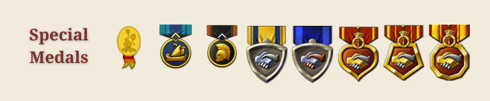

# How Medals work

> Source: Travian: Legends Support  
> URL: https://support.travian.com/en/articles/168-how-medals-work

---

## When medals are awarded

- **Weekly medals** are granted **every Monday at 00:00 (server time)** for the previous week’s performance.

## Weekly player medals (Top-10)

You can earn a ribbon each week by placing in the **Top-10** for:

- **Attackers**
- **Defenders**
- **Raiders**
- **PvE** (kills vs. **Natars** and **unoccupied oases**)

### Streak & repeat medals

- **Top-3 best** in the same category **3/5/10 times** (not consecutive).
- **Top-10 best** in the same category **3/5/10 times** (**consecutive**).
- **Top-10 both Attacker & Defender** in the same week **1/2/3 times** (**consecutive**).

---

## Weekly alliance medals (Top-10)

Alliances receive Top-10 medals for:

- **Attack**, **Defense**, **Raiding**, and **Climbers** (**population growth** replaces PvE for alliances).
Alliance medals show **laurel branches** around the ribbon.

---

## Tournament medals

Awarded for **Tournament Qualifications** and **Finals** participation/performance:

- **Attack**, **Defense**, **Population**, **World Wonder**, and **Survivor** (played to the end).
These sets were **recently refreshed** visually.

---

## Local medals

A newer category: medals for **participation in Local gameworlds** (e.g., the first was **Titani**—Italy—designed with community input).

---

## Special medals

Given for unique cases, including:

- **Special test worlds** (e.g., Loyal Legend),
- Winners of **Glory of Sparta** and **Shores of War**,
- **Veteran** medals for **3/5/10 years** of play.
The rarest is the **Hammelburg meeting medal** (one-time award for attendees in 2009). The **first-ever medal** was the **dove of peace** (shown during beginner’s protection and then fades).

