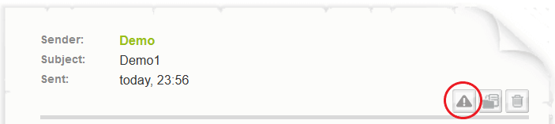
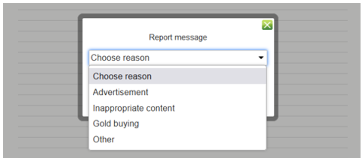
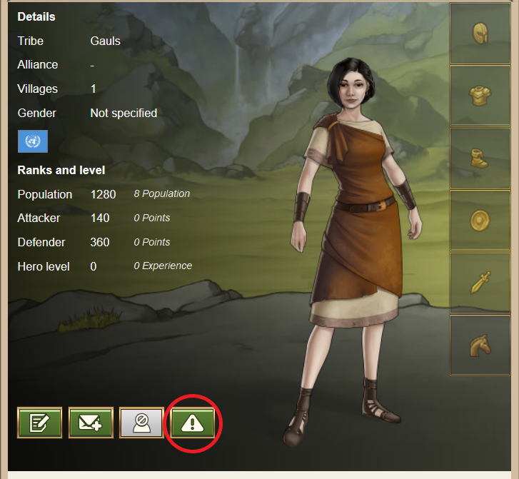
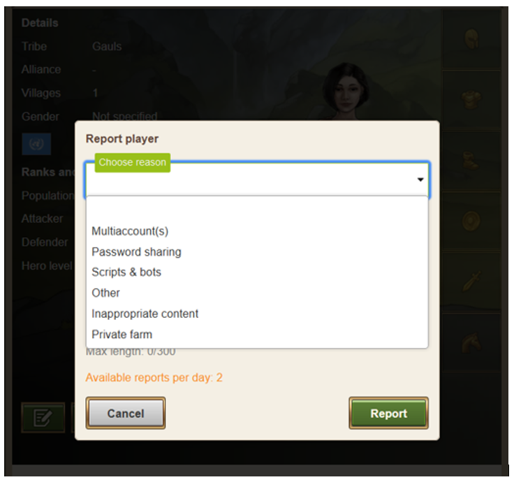
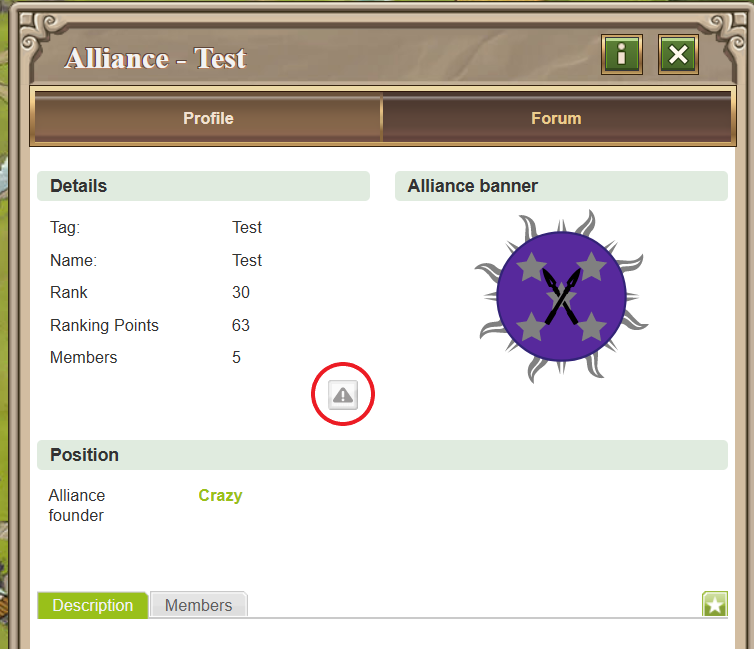
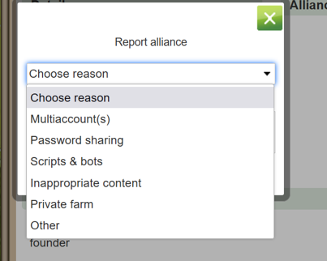

# I think a player is violating game rules - what can I do?

> Source: Travian: Legends Support  
> URL: https://support.travian.com/en/articles/121-i-think-a-player-is-violating-game-rules-what-can-i-do

---

If you believe another player is breaking the game rules, you can easily **report them directly in-game**.
Reports are carefully reviewed by either:

- The **Customer Service Team** (for netiquette or insult-related cases)
- The **Player Safety Team** (for all other violations)

Choosing the **correct report reason** ensures it reaches the right team faster.

---

### Reporting an Ingame Message (IGM)

If you want to report an inappropriate or suspicious in-game message:

1. Open the message.
2. Click the **Report button** (triangle icon).
3. Choose the reason from the dropdown list.

**Available reasons:**

- **Advertisement** – Spam or ads.
- **Inappropriate content** – Harassment, insults, or offensive messages.
- **Gold buying** – Messages offering or requesting Gold outside the game.
- **Other** – Any other type of rule violation (e.g. admission of cheating).

> *If several messages are related to the same issue, report each one separately — only the reported messages are visible to the team*

#### Available reasons:

- Multiaccount(s)

	- You think the player has multiple avatars on this gameworld.
	- Include a list of the avatars you suspect the player owns.
- Password sharing

	- You think the player has shared his password with another player or used another player's password.
	- Explain it in the description section and mention who is the other involved player or players, if you know that.
- Scripts & Bots

	- You believe that this avatar is played by a bot, or the player is using scripts or other software to play the game, not just a regular browser.
- Other

	- Anything that doesn’t fit any of the other categories. Make sure to explain clearly why you are reporting the player.
- Inappropriate content

	- Some content in the player’s profile, or other places such as the nickname or village names, is offensive or violates other rules.
- Private farm

	- If you suspect someone of having or being a private farm.

### Reporting an Alliance

To report a rule-breaking **alliance**:

1. Go to the **alliance profile**.
2. In the “Details” section, click the **Report button**.
3. Select the reason for your report.

**Available reasons:**

- **Multiaccount(s)** – Players in the alliance using multiple avatars.
- **Password sharing** – Players using or sharing others’ passwords.
- **Scripts & bots** – Members using automated scripts or bots.
- **Inappropriate content** – Offensive alliance names, tags, or descriptions.
- **Private farm** – The alliance supports or benefits from private farming.
- **Other** – Anything else not listed; provide as much detail as possible.

> You can submit **up to two reports per day**. Include clear explanations — the more context, the easier it is for the team to investigate.

#### What Happens Next?

- Reports are investigated by the **Rule Enforcement Team (RET)** or **Customer Service**, depending on the case.
- All investigations require **evidence**; rumors or speculation alone are not enough.
- Your report may still provide valuable information that helps complete an ongoing case.

You’ll receive an **in-game message** when your report has been reviewed and closed.

---

### Why Don’t I Get Details About the Result?

Due to **GDPR and privacy regulations**, support staff cannot share the outcome or any private information about another player’s account.

Also note:

- Some bans or penalties may not be visible to others (e.g. message restrictions, resource removal, warnings).
- Not every visible change (like population drop) indicates a punishment.

---

### Summary

- Use the in-game report buttons.
- Choose the correct reason.
- Include clear details to help the investigation.
- Wait for confirmation — no further updates can be shared due to privacy rules.
