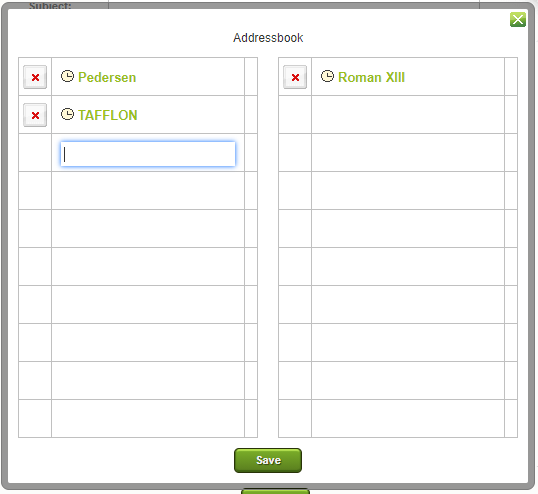

# In-Game Messages (IGMs)

> Source: Travian: Legends Support  
> URL: https://support.travian.com/en/articles/57-in-game-messages-igms

---

### Writing Messages

To send an in-game message:

1. Open the **Messages** tab.
2. Click **“Write”**.
3. Add the **recipient**, **subject**, and your **message text**.
4. Click **Send**.

If you’re part of an **alliance** and have the right permissions, you can also send:

- **Mass Messages (MM)** or
- **Ally Messages**

You can do this by:

- Typing **[ally]** in the recipient field, or
- Clicking the **blue alliance icon**.

When you send an MM, **all players in your alliance** will receive the message. [Message Archive](https://support.travian.com/en/support/solutions/articles/7000061580)

---

### Formatting with BBCode

You can format your messages using **BBCode**, just like a text editor.
You can make your text *italic*, **bold**, or <u>underlined</u> — or combine them all.

---

### Linking in Messages

You can link in-game elements directly in your messages:

- Linking an **alliance** in the message when you enter the alliance name.
- Linking a **player** in the message when you enter the player name between code blocks.
- Linking a **village** by its coordinates, which will take you to the map coordinates you’ve entered.
- Linking a **report** in your message; for this, you need the report ID number taken from the last part of the report URL in your browser address, e.g.: `[report]2187686[/report]`

---

### Address Book

You can open your **Address Book** by clicking the **book icon**.

- From there, click to **add a new account** to your address book.
- This sends a **request** to the player, which they need to **accept**.
- Until accepted, the entry will be shown as **pending**.

---

### Sorting Messages

You can sort your messages by **date** in either ascending or descending order.
Click the **“Sent”** or **“Received”** column headers to switch the order.

---

### Reporting Spam

If you receive a **spam message**, report it directly to the **Customer Service Team** by clicking the **“Report”** button.

---

### Ignoring Players

If you want to stop receiving messages from a player:

1. Go to their **profile**.
2. Click **“Ignore”**.
3. Messages from that player will no longer be delivered to you.

You can see which players you’re currently ignoring by opening:

> **Messages → Ignored Players**

---

### Automatic Deletion of Messages and Reports

IGMs and reports are automatically deleted when:

- **3 days after the recipient deletes the IGM**,
*(they’re also deleted from the sender’s Sent box)*, or
- When a player has **more than 30 messages or reports older than 3 days** that are **not archived**.

To keep important messages, use the **Archive** feature.
