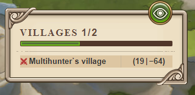

# Incoming attack warning in village list

> Source: Travian: Legends Support  
> URL: https://support.travian.com/en/articles/70-incoming-attack-warning-in-village-list

---

The **Incoming Attack Warning** is a **premium feature** that is part of [Travian Plus Membership](https://support.travian.com/articles/127). It provides additional visual alerts when any of your villages are under attack.

---

### How It Works

When this feature is active, you will see **red sword icons** appear next to villages that are being attacked.
These swords are displayed in the **village list** on the **right side of the game screen**, as shown in the example below:

---

**Example: Incoming attack warning displayed in the village list**

### Visibility of Village List Attacks (Travian Plus Feature)

- Villages under attack display **red swords** in the list.
- If an incoming attack is **flagged with a green ball** in the **Rally Point**, it will **not** show red swords in the village list.

	- See more: [Flagging of Attacks](https://support.travian.com/articles/68)

**Note:**
This setting affects only your **own village list**.
It does **not** impact the **alliance list**, which can also display incoming attacks depending on the server type.

---

### Visibility of Alliance List Attacks (Special Servers Only)

On **special servers**, alliance members can see incoming attacks and raids in their **alliance member list** — but only under specific conditions.

- Attacks and raids appear **only** if the number of incoming troops is **equal to or greater** than the **Rally Point level** of the targeted village.
- For example:

	- If the Rally Point in the target village is **level 20**, attacks with fewer than **20 units** will **not appear** on the alliance page.
- Attacks and raids are displayed **separately** in the alliance interface.
- The **Eagle Eyes ancient power** does **not** affect this visibility.
