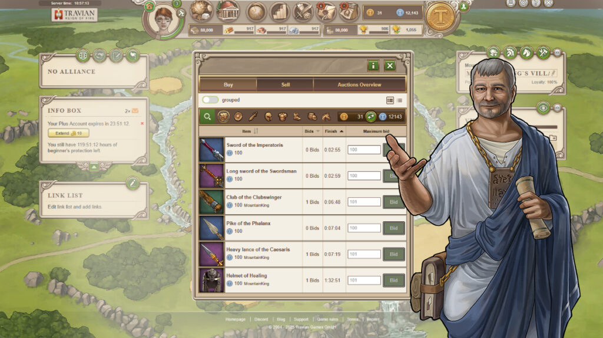

# Legends’ Auction House 2.0

> Source: Travian: Legends Support  
> URL: https://support.travian.com/en/articles/196-legends-auction-house-20

---

- **New Auction House Arrives**

	- A brand-new Auction House is being introduced to Travian: Legends – not just as a feature of the Annual Special, but as a permanent upgrade for all gameworlds starting August 1st.
	- This overhaul was necessary to ensure full compatibility with the Item Crafting system – but it brings much more than that.
- **Key Features**

	- More than just a visual revamp, the new Auction House comes with a number of powerful improvements:

		- Search Field with Autocomplete – Quickly find items by typing their names.
		- Shareable Views – Create and share links to specific filtered views of the Auction House.
		- Amount Filter – Narrow results to offers of a specific quantity (great for ointments, cages, and more).
		- Personal Auction History – View your bidding, selling, and purchase activity in one clean overview.
		- Quick Refresh Option – Instantly refresh the Auction House listings without reloading the entire game.
- **New Auction Fee**

	- Introducing a transaction fee system: when an item is sold through the Auction House, 2% of the winning bid goes to the Natars. The seller receives 98% of the final price.
	- This improved Auction House is here to stay – giving you more speed, control, and flexibility than ever before.
