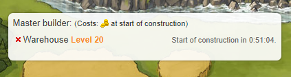

# Master Builder

> Source: Travian: Legends Support  
> URL: https://support.travian.com/en/articles/37-master-builder

---

The **Master Builder** is a **Gold Club feature** that lets you **queue additional building constructions** — even when you don’t currently have enough resources. It costs **1 Gold per use**, and the Gold is deducted **when the construction begins**.

---

## How It Works

- If your **workers are busy** or you **lack the required resources**, you can still queue the next construction using the Master Builder.
- The queued construction will **automatically start** once:

	- You have enough resources, **and**
	- Your workers are free.

You’ll see the planned start time displayed on-screen, assuming your resources remain available.

## Key Details

- Each queued task costs **1 Gold**.
- The Gold is charged **at the moment the task starts**, not when you add it to the queue.
- You can use this feature for **any building or resource field** upgrade, as long as you meet the building prerequisites.
