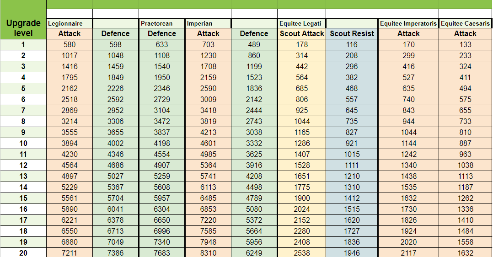
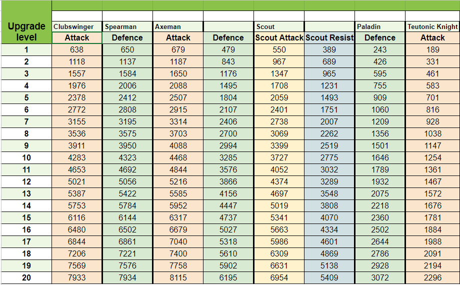
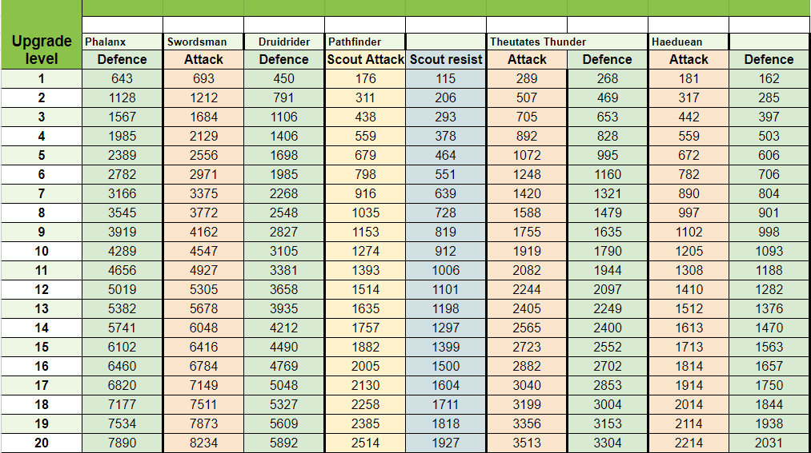
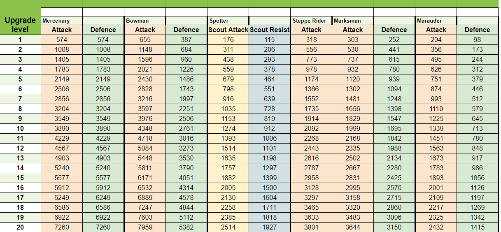
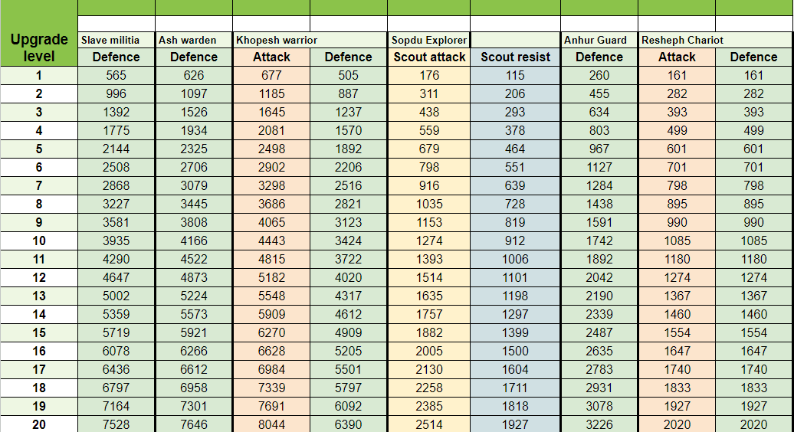
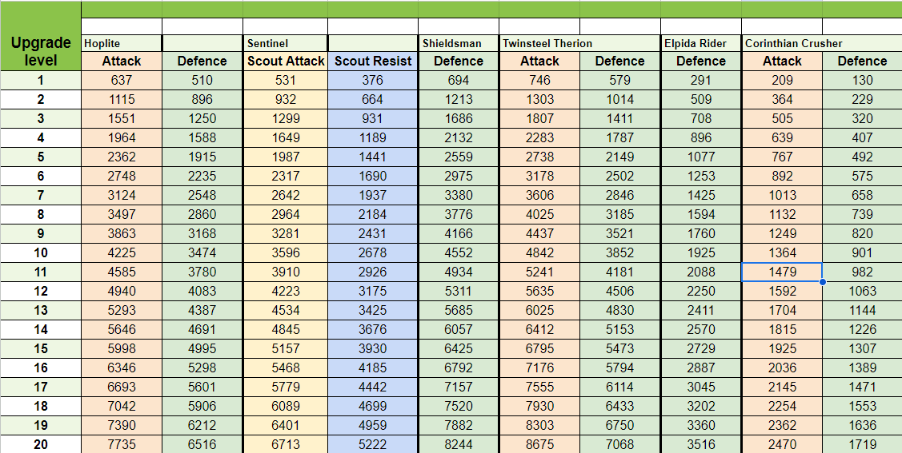
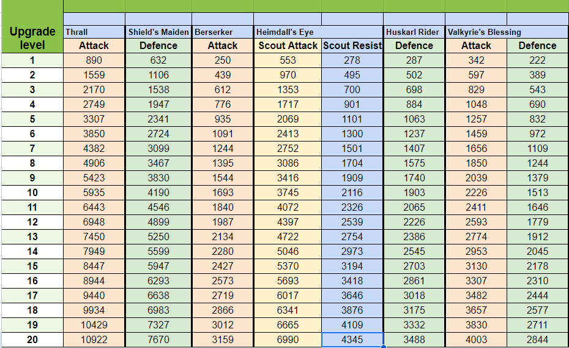

# More Troops or Smithy Upgrades?

> Source: Travian: Legends Support  
> URL: https://support.travian.com/en/articles/186-more-troops-or-smithy-upgrades

---

A common question for both new and experienced Travian: Legends players is when it makes more sense to upgrade units in the Smithy instead of simply training more troops. This guide helps you understand how to decide the right moment to invest in upgrades for maximum benefit.

---

## How This Works

Smithy upgrades increase the combat strength of your units. However, upgrades cost resources, so the key question is: **When does upgrading provide more value than training additional units?**

The tables in this guide show **how many troops of each type** you should have before upgrading becomes more efficient than training new ones.

---

## Important Notes

Before using the tables, keep these points in mind:

- Only upgrade costs are considered (not the cost of constructing or upgrading the Smithy itself). If you include Smithy construction, the efficient troop numbers become slightly higher.
- Scout comparisons use “Scout Attack” (35) and “Scout Resistance” (20) values instead of standard attack/defense. These values are identical across tribes, but Smithy upgrades create small differences.
- Two-crop units become slightly more effective after upgrades due to the formula.
- For defense, one-crop scout units (Sentinels, Scouts, Spotters, etc.) remain more resource-efficient despite weaker upgrades.

---

## Smithy Upgrade Tables

Below you will find the full upgrade efficiency tables for every tribe. Each table lists **unit strength per upgrade level**, allowing you to compare the benefit of upgrading versus producing new units of the same type.

- **Romans** (Legionnaire, Praetorian, Imperian, Equites Legati, Equites Imperatoris, Equites Caesaris)

- **Teutons** (Clubswinger, Spearman, Axeman, Scout, Paladin, Teutonic Knight)

- **Gauls** (Phalanx, Swordsman, Druidrider, Pathfinder, Theutates Thunder, Haeduan)

- **Huns** (Mercenary, Bowman, Spotter, Steppe Rider, Marksman, Marauder)

- **Egyptians** (Slave Militia, Ash Warden, Khopesh Warrior, Sopdu Explorer, Anhur Guard, Resheph Chariot)

- **Spartans** (Hoplite, Sentinel, Shieldsman, Twinsteel Therion, Elpida Rider, Corinthian Crusher)

- **Vikings** (Thrall, Shield’s Maiden, Berserker, Heimdall’s Eye, Huskarl Rider, Valkyrie’s Blessing)

