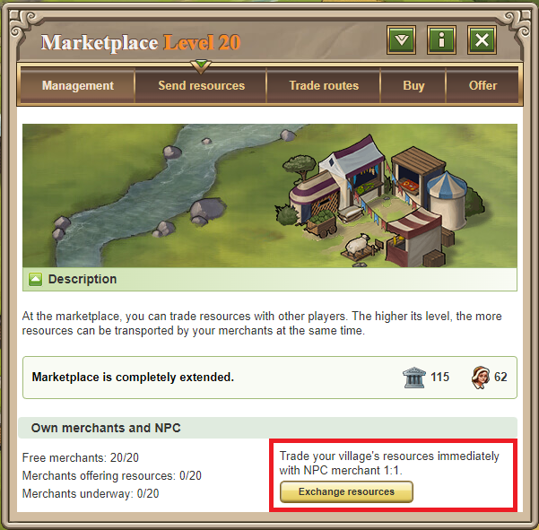
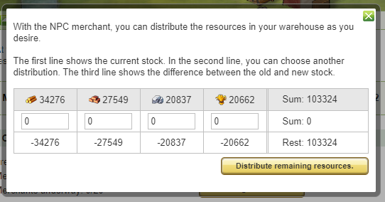

# NPC Merchant

> Source: Travian: Legends Support  
> URL: https://support.travian.com/en/articles/38-npc-merchant

---

The **NPC Merchant** is a **premium Gold feature** that costs **3 Gold** per use.
It allows you to **redistribute your resources** within a village — exchanging any resource type for another at a **1:1 ratio**.

---

## How to Use It

1. Go to the **Marketplace → Management tab**.
2. Click **“Exchange resources”** to open the NPC trade window.
3. Redistribute your resources as needed.
4. You can also click **“Distribute remaining resources”** to balance all resources equally.

## Quick Access from Buildings

You can also use the NPC Merchant directly from **any building** that allows it.

- If you don’t have enough resources for an upgrade, a **Gold button** labeled **“Exchange resources”** will appear.
- Clicking it opens the NPC window, where resources are automatically prefilled to match the **upgrade requirements**.
- After confirming, you’ll return to your previous view with the trade complete.

## Exceptions

The NPC Merchant **cannot be used** in the following cases:

- The amount you want to exchange is **less than 50**.
- You **don’t have enough Gold** for the transaction.
- The **building already has enough resources** for the selected upgrade — the button won’t appear.

> [Gold, Plus, and Gold Club Features](https://support.travian.com/articles/126)

---

**Tip:**
Use the NPC Merchant when you have too much of one resource and not enough of another — it’s especially useful when training troops or finishing a major upgrade.
