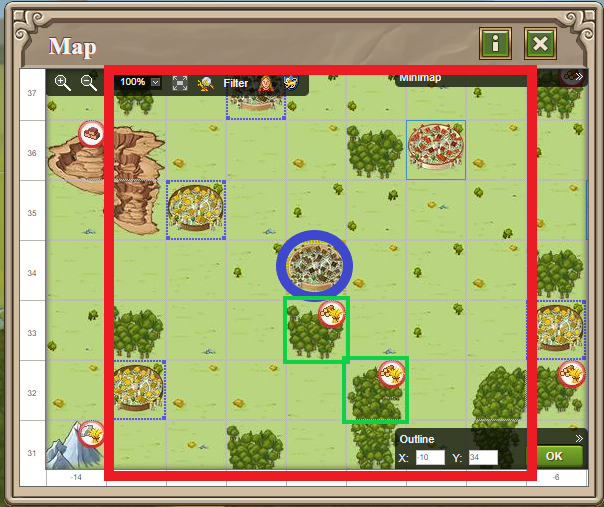
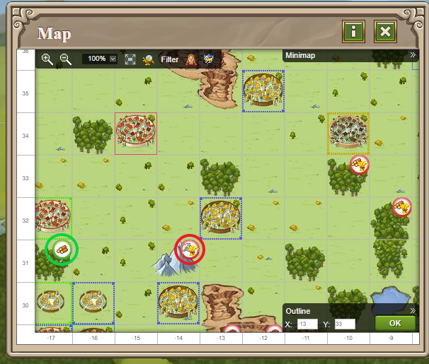
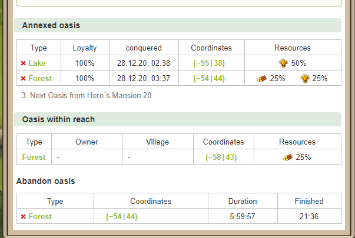

# Oasis

> Source: Travian: Legends Support  
> URL: https://support.travian.com/en/articles/48-oasis

---

At the beginning of the game, **oases are occupied by wild animals** and do not produce any resources. Resource production only starts once all animals in the oasis have been removed—either by killing them or capturing them. During the early game, nature troops spawn **only once**. If you clear the oasis during this phase, it remains empty until the end of **Beginner Protection** (depending on server speed). After that, nature troops can spawn again and will slowly multiply. The fewer animals left, the faster they respawn.

You can check the number of animals in an oasis without scouting by hovering over it or clicking it on the map. When you kill a nature troop, your hero automatically receives a **bounty reward** based on the troop's crop consumption. This reward appears in your hero inventory and is shown clearly in the combat report.

The hero does *not* need to survive for this reward to be granted.

---

## **Oasis Types and Bonuses**

Each resource type has two kinds of oases:

- **Type 1:** Produces only one resource (e.g., wood, clay, iron, or 25% crop).
- **Type 2:** Produces one resource **plus crop**.

When you conquer an oasis, it grants a **production bonus to the village** from which your hero conquered it.
This bonus applies only to the village’s **base production**, not modified production.

Oases on the map also show:

- The **type of resource bonus** they provide
- Whether they are **free** or **already conquered**

|  | Appearance | Increase when occupied | Production when not occupied(1x speed) | Production when not occupied(1x speed) | Production when not occupied(1x speed) | Production when not occupied(1x speed) | Capacity when not occupied |
| --- | --- | --- | --- | --- | --- | --- | --- |
| Type 1 |  | +25% lumber per hour | 40 Lumber | 10 Clay | 10 Iron | 11 Crop | 1000 each |
| Type 2 |  | +25% lumber per hour,+25% crop per hour | 40 Lumber | 10 Clay | 10 Iron | 41 Crop | 2000 each |
| Type 3 |  | +50% lumber per hour (only available in the grey Natarian area) | 80 Lumber | 10 Clay | 10 Iron | 11 Crop | 2000 each |
| Type 1 |  | +25% clay per hour | 10 Lumber | 40 Clay | 10 Iron | 11 Crop | 1000 each |
| Type 2 |  | +25% clay per hour,+25% cropper hour | 10 Lumber | 40 Clay | 10 Iron | 41 Crop | 2000 each |
| Type 3 |  | +50% clay per hour (only available in the grey Natarian area) | 10 Lumber | 80 Clay | 10 Iron | 11 Crop | 2000 each |
| Type 1 |  | +25% iron per hour | 10 Lumber | 10 Clay | 40 Iron | 11 Crop | 1000 each |
| Type 2 |  | +25% iron per hour,+25% crop per hour | 10 Lumber | 10 Clay | 40 Iron | 41 Crop | 2000 each |
| Type 3 |  | +50% iron per hour (only available in the grey Natarian area) | 10 Lumber | 10 Clay | 80 Iron | 11 Crop | 2000 each |
| Type 1 |  | +25% crop per hour | 10 Lumber | 10 Clay | 10 Iron | 41 Crop | 1000 each |
| Type 2 |  | +50% crop per hour | 10 Lumber | 10 Clay | 10 Iron | 81 Crop | 2000 each |

---

## **Conquering Natural Oases**

To conquer an oasis, it must be within **3 tiles** of your village (the small map area around your village).
Required Hero’s Mansion levels:

- Level **10** → 1 oasis
- Level **15** → 2 oases
- Level **20** → 3 oases

Your hero must attack the oasis repeatedly until it becomes annexed by the village they attacked from.

---

## **Conquering Player-Owned Oases**

To take an oasis from another player:

- Destroy the defense
- Attack with your hero a number of times depending on how many oases the defender owns:

|  | Defender owns…Hero attacks needed |
| --- | --- |
| 3 oases | 1 attack |
| 2 oases | 2 attacks |
| 1 oasis | 3 attacks |

Heroes do *not* disappear after conquering an oasis.

---

## **Raiding Oases**

Raiding a player-owned oasis allows your troops to steal **up to 10% of the owning village’s resources**.
Oasis resources regenerate fully after **10 minutes**.

If you raid the same oasis earlier (e.g., 7 minutes later), you only take the matching percentage (7%).
Raiding your own oases results in **your own village losing resources**, giving you **0 net gain**.

You can reinforce your oasis with troops for defense. These troops are fed by the owning village and can be sent back via the village’s Rally Point.

---

## **Oasis Loyalty**

Oasis loyalty increases automatically by **1% every 30 minutes**, and players cannot influence this rate.
If you conquer an oasis from another player, its loyalty instantly returns to **100%**.

---

## **Releasing an Oasis**

If you want to release an oasis you own:

- Open the Hero’s Mansion
- Click the **red cross** next to the oasis
- A timer will begin, and the oasis is released after the countdown finishes

Release time:

- About **2 hours** on 3x speed
- About **6 hours** on 1x speed

Note: If your village is conquered, all its oases are automatically released—even if you later recapture your own village.

