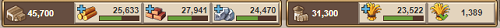
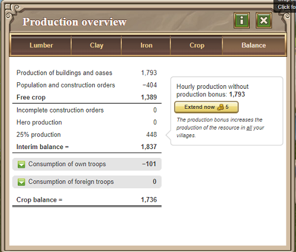

# Problems with Crop

> Source: Travian: Legends Support  
> URL: https://support.travian.com/en/articles/75-problems-with-crop

---

Crop is one of the most important resources in Travian: Legends. Many early difficulties come from managing crop production, because **buildings, fields, and troops all consume crop every hour**.

You can see crop consumption clearly in building requirements. For example, a **level 1 woodcutter** consumes **2 crop per hour**. All crop consumption from population and troops is cumulative.

Your current **resource storage** and **free crop** are shown at the top of the screen.

To improve your crop production, you can upgrade:

- **Croplands**
- **Grain Mill**
- **Bakery**

Keep in mind that level 1 cropland requires **20 crop** to construct.

---

## **Negative Crop Production**

If your population and troops consume more crop than you produce, your crop balance becomes **negative**.
When this happens:

- Your granary will begin to empty.
- If the stored crop reaches **0**, troops will slowly **starve and die**.
- Starvation stops once the crop production reaches **0** again.

You can view detailed crop usage by clicking the **crop balance icon** in the top bar.

---

## **Free Crop**

**Free crop** is your crop production minus your total population.

Free crop **includes**:

- Oasis bonuses
- Grain Mill and Bakery bonuses

Free crop **does not include**:

- Hero production bonus
- Plus account crop bonus

Normally, buildings or upgrades that would reduce free crop below **1** cannot be started.
However, there are important exceptions.

---

## **Limitations and Exceptions**

You **can always**:

- Upgrade a cropland
- Build or upgrade a Grain Mill or Bakery if the upgrade increases free crop
- Build a **Main Building level 1**

You can also build or upgrade the following to **level 10**, regardless of free crop, if your **base crop production** in the village is **276 per hour or more**:

- Main Building
- Warehouse
- Granary

**World Wonders** are always exempt and may be upgraded regardless of crop.

You **cannot** destroy a Grain Mill or Bakery if doing so would reduce free crop below **1**.

---

## **Hero Crop Production**

Your hero always produces **6 crop per hour**, no matter how skill points are allocated.
Important rules:

- Hero crop production is added to the village the hero belongs to.
- This production **does not increase free crop**.
- A dead hero continues to produce 6 crop per hour.
- When revived, hero resource production and hero crop consumption begin at the same time.
