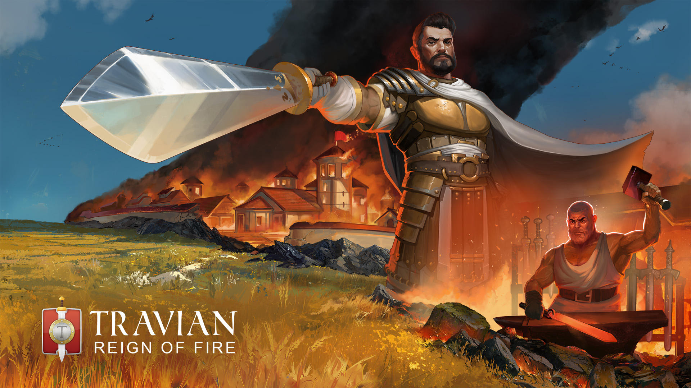

# Reign of Fire - Game Mechanics

> Source: Travian: Legends Support  
> URL: https://support.travian.com/en/articles/21-reign-of-fire-game-mechanics

---

**Reign of Fire** is the **2025 Annual Special** of Travian: Legends. This guide gives an overview of how this special differs from regular gameworlds while keeping all original mechanics descriptions.

---

## **Main Features Kept from Previous Annual Specials**

Reign of Fire continues to use several established Annual Special mechanics:

- **Ancient Europe map** with **region-based spawning**, and unlike Northern Legends, the **edges can be crossed**.
- **87 conquerable regions** that generate **Victory Points (VPs)** instead of a World Wonder endgame. VP numbers have been adjusted.

	- [Special Servers - Regional Map](https://support.travian.com/articles/27)
	- [Special Servers - Regions and Population](https://support.travian.com/articles/26)
- **Victory Points stored in villages**.

	- [Special Servers - Ancient Powers and Victory Points](https://support.travian.com/articles/106)
- **Keep Tribe on Conquer** feature.

	- [Special Servers - Keep Tribe on Conquest](https://support.travian.com/articles/29)
- **Troop forwarding** (including bulk forwarding) and **troop merging**.

	- [Special Servers - Keep Tribe on Conquest](https://support.travian.com/articles/72)
	- [Special Servers - Merging Troops](https://support.travian.com/articles/73)
- **Cities** and **Watchtowers** remain part of gameplay.

	- [Special Servers - Cities](https://support.travian.com/articles/79)
	- [Special Servers - Watchtowers](https://support.travian.com/articles/78)
- **Alliance attack and raid visibility** in the alliance member list.

	- [Special Servers - Alliance Attack Notifications](https://support.travian.com/articles/31)
- **No confederacies**.
- **Faster construction:** All resource fields plus the Main Building, Granary, and Warehouse (including great variants) build **25% faster**.
- **Improved alliance bonuses:**

	- The **commerce bonus** increases merchant speed and capacity.
	- The **philosophy bonus** improves Town Hall celebrations and artworks, and increases their limits.
- **Choose the tribe** of your **first three settled villages.** Conquest does not count. This choice cannot be reused even if those villages are lost.

---

## **Changes Compared to Northern Legends**

- Map edges can be crossed (same as normal worlds).
- No harbours or ships.
- Vikings are not included; **Teutons are back**.
- Roman troops match the regular gameworld version. Legionnaires no longer fill the Teuton spearman role.

---

## **New Features in Reign of Fire**

### **Item Rarity**

Equipment now comes in **four rarity levels**:

- **Common, Uncommon, Rare, Epic**

Rarity combines with the usual **three quality tiers**, meaning items can offer higher bonuses than before.

- [Special Servers - Common, Uncommon, Rare and Epic Items](https://support.travian.com/articles/23)

### **More Adventures**

- Adventures are generated **twice as fast**.
- On x1 worlds, you receive about **6 per day for the first 3 days**, instead of 3.
- Higher-speed worlds scale accordingly.
- You must complete **20 adventures** (instead of 10) before accessing the Auction House.

Because there are more adventures, both **difficulty** and **hero experience** per adventure are about **half** of regular values. Damage may vary slightly due to hero fighting strength, but is generally lower.

### **Better Loot**

- Adventures now give **better rewards**, and equipment is more common.
- As the game progresses, the rarity of items found gradually increases
(though **epic items** are not found in adventures).

### **Item Crafting**

Players can:

- **Smelt items** into material
- **Forge new items**
- **Refine items** to increase their rarity and improve bonuses
- [Special Servers - Item Crafting](https://support.travian.com/articles/22)

### **Adjusted Hero Damage Model**

A new system changes how damage reduction items work:

**Regular worlds:**

- Item bonuses apply first, then damage is checked.
- If the final damage is **90 or more**, the hero dies.
- Best item reduces damage by up to **8 HP**.

**Reign of Fire:**

- If **initial damage is 95 or more**, the hero dies immediately (before reductions).
- If **initial damage is below 95**, item bonuses apply, and the hero only dies if the final damage equals or exceeds the hero’s remaining health.

**Example from the original text (page 3):**
A hero with an item reducing damage by 8 HP and full health:

- Hit for 96 damage →

	- **Regular worlds:** survives with 12 HP.
	- **Reign of Fire:** dies because initial damage ≥ 95.
