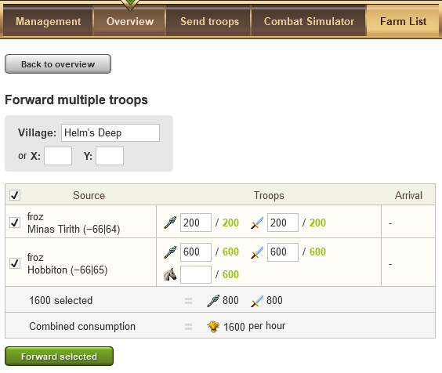

# Special Servers - Forwarding Troops

> Source: Travian: Legends Support  
> URL: https://support.travian.com/en/articles/72-special-servers-forwarding-troops

---

The **Troop Forwarding** feature is available only on **special servers** of *Travian: Legends*.
It allows alliance members to **forward support troops** directly to another village within the same alliance.
This feature is **free** and can be used for both your own troops and those received as reinforcements from allies.

---

### How to Forward Troops

You can forward either multiple support groups at once or a single group.
Both actions are done through the **Rally Point** in the village where the troops are currently stationed.

---

#### Forwarding Multiple Groups

1. Open the **Rally Point** in the village where the units are stationed.
2. Go to the **Overview** tab and click **Bulk Forward**.
3. Select the **target village**, then choose which groups of troops to forward.
4. Adjust troop numbers if needed and confirm the order.

The screenshot below shows the *Bulk Forward* interface, where players can select multiple sources and destinations in one action:

---

**Example: Forwarding Multiple Troops Interface**

#### Forwarding a Single Group

If you only need to forward one group of troops:

1. Find the group in the **Overview** tab of the Rally Point.
2. Click the **Forward** link beside the unit group.
3. Choose the **target village**, adjust troop numbers if needed, and confirm the action.

---

### Additional Information

To use troop forwarding, the following conditions must be met:

- You must be **a member of an alliance**, even to forward your own troops between your own villages.
- You can forward:

	- **Troops received** from another member of your alliance, or
	- **Your own troops** that were originally sent as reinforcements from another of your villages.
- You can **only forward troops** to a **village belonging to a member of your alliance** (including your own).
- While moving, **forwarded troops consume crop** from the **village where they start the movement**, not from their home village.
- Forwarded troops **travel at a speed** determined by their **home village bonuses** (for example, Tournament Square effects).
