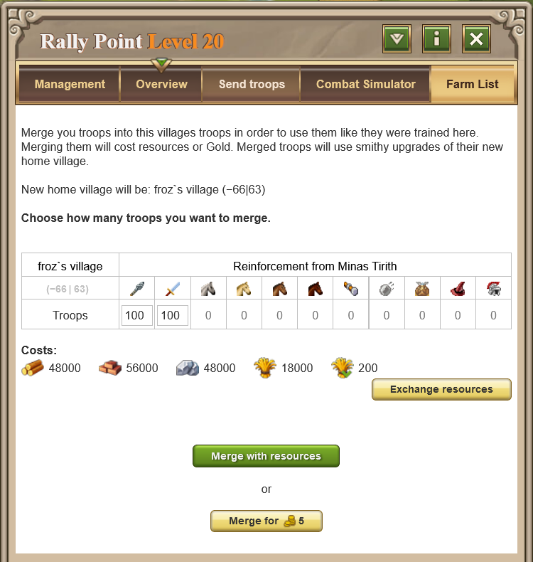

# Special Servers - Merging Troops

> Source: Travian: Legends Support  
> URL: https://support.travian.com/en/articles/73-special-servers-merging-troops

---

Merging troops is a **special server feature** that allows you to combine troops from different villages into a single army. Merged troops behave exactly as if they were **trained in their new home village**, including benefiting from that village’s **Smithy upgrades**. Merging always costs **resources or Gold**.

---

## **How to Merge Troops**

1. **Send the troops** you want to merge to the target village (their future home).
2. Open the **Rally Point** in the target village.
3. In the **Overview** tab, find the incoming reinforcements you sent.
4. Click **“incorporate into village.”**
5. Select how many troops you want to merge (this determines the cost).
6. Complete the merge by paying with **resources** (NPC is allowed) or **Gold**.

---

## **Restrictions**

- You can only merge troops that **belong to your own avatar**.
- You can only merge troops of the **same tribe** as the target village.
- You **cannot** merge:

	- Settlers
	- Administrators (chiefs, senators, etc.)
	- Siege weapons (catapults, rams)
	- The hero (the hero can simply move between villages)
- Research levels do **not** matter — you can merge units into a village even if the unit type was never researched there.
- Gold merges are limited to **50 Gold per village per day**, resetting with the daily quest reset.
- Merging with **resources** has no limit.

---

## **Merging Costs**

The cost of merging is based on the **recruitment cost** of the units being merged:

- **Total merging cost = 2 × (recruitment cost of the units)**
- If paying with Gold:

	- Gold cost = total resource cost ÷ 40,000, **rounded up**

### **Example**

You want to merge **1,000 Clubswingers**:

- Recruitment cost of 1 Clubswinger = **250 total resources**
- Total resource cost for merging = **250 × 1,000 × 2 = 500,000**

	- (190,000 wood, 150,000 clay, 80,000 iron, 80,000 crop)
- Gold cost = **500,000 ÷ 40,000 = 13 Gold**

