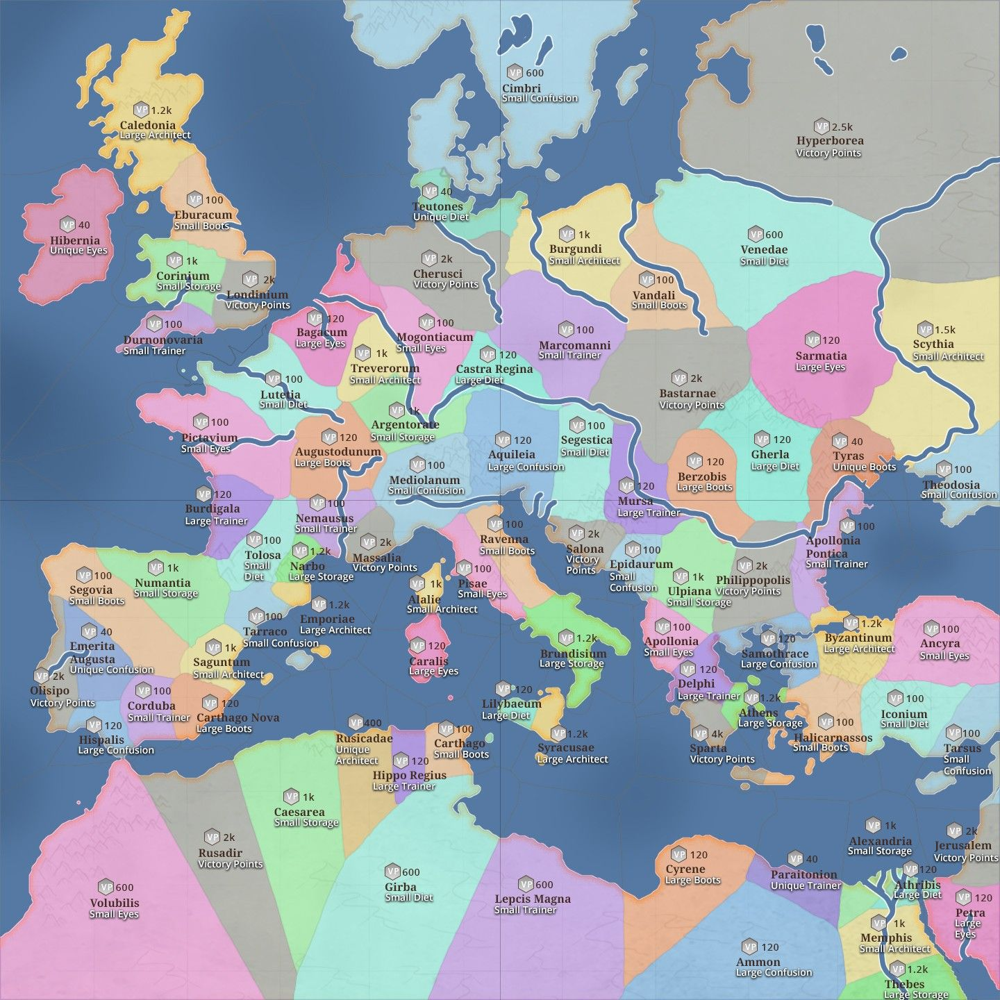

# Special Servers - Regional Map

> Source: Travian: Legends Support  
> URL: https://support.travian.com/en/articles/27-special-servers-regional-map

---

In annual special servers of **Travian: Legends**, the game takes place on a map of **Ancient Europe**, divided into **87 regions**. The map below shows all regions, their **Victory Point (VP)** values, and their **Ancient Powers**. Each year’s special may slightly adjust the VP distribution — for example, in *Northern Legends (2024)*, the number of Victory Points per region was rebalanced.

---

## Map Overview

- Each color represents a **type of Ancient Power** available in that region.
- Different shades of the same color distinguish between **small**, **large**, and **unique** versions of the same power.
- Victory Point values are displayed directly on the map (e.g., 100 VP/day).

---

## Ancient Power Types

Here’s what each short label on the map means:

| **Name** | **Effect** |
| --- | --- |
| **Architect** | Stronger building durability |
| **Boots** | Faster troop movement |
| **Confusion** | Stronger cranny and random targeting protection |
| **Diet** | Reduced crop consumption by troops |
| **Eyes** | Improved spy effectiveness |
| **Storage** | Unlocks Great Warehouse and Great Granary plans |
| **Trainer** | Faster troop training speed |

The effects of these powers are identical to artefacts on regular gameworlds with a Wonder of the World, but **Annual Special servers do not include the “Fool” artefact** (random power).

> [Artefact Effects](https://support.travian.com/articles/102)
> [Regions and Population](https://support.travian.com/articles/26)

**Tip:** The center regions with high Victory Point values are the most contested — plan your alliance expansion carefully before moving toward them!
