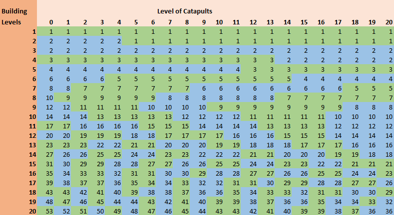

# The Use of Catapults

> Source: Travian: Legends Support  
> URL: https://support.travian.com/en/articles/181-the-use-of-catapults

---

Catapults are long-range siege units used to destroy enemy buildings and resource fields in Travian: Legends. They require careful planning because their effectiveness depends on attack type, Rally Point level, upgrades, and artefact effects.

---

## What Catapults Can (and Cannot) Do

- Catapults **only fire in a normal attack**, not in raids.
- They need **time to shoot**, so their damage is applied only after they arrive.
- Their efficiency is influenced by various factors, including your Rally Point, smithy upgrades, and defender bonuses.

---

## Rally Point Requirements

Your Rally Point level determines which buildings you can target:

**RP Level 1** – Only random targets
**RP Level 3** – Warehouse and Granary
**RP Level 5** – Resource production buildings (fields, brickyard, iron foundry, sawmill, grain mill, bakery)
**RP Level 10** – Everything except Cranny, Stonemason’s Lodge, Trapper
**RP Level 20** – You can target **two different buildings** in one attack

- Requires **at least 20 catapults**
- Damage is split evenly between the two targets

**Important:**
If you only want to hit **one building** at RP20, leave the second target slot empty.
Selecting the same building twice splits your damage and is **weaker**, especially dangerous in World Wonder operations.

---

## What Affects Catapult Damage?

### **Capital With Stonemason’s Lodge**

- Increases building durability by **10% per level**
- Up to **300% total durability** at level 20
- Applies to both resource fields and village buildings

### **Alliance Metallurgy Bonus**

- Increases attack stat only
- **Does NOT** increase catapult destruction power

### **Architect Artefact (Defender)**

- Increases building durability:

	- Small: ×4
	- Great: ×3 (applies to whole account)
	- Unique: ×5
- More catapults are needed to destroy the same target

### **Confusion (Random Target) Artefact**

- Makes catapults hit semi-random targets
- Internals vs. resource fields are still respected
- After all buildings of a selected type are destroyed, catapults hit remaining buildings
- Stonemason’s Lodge is **always hit last**
- Special rules:

	- Small Confusion: Treasury can still be targeted
	- Great Confusion: Treasury + World Wonder
	- Unique Confusion: Only World Wonder

### **Brewery (Attacker)**

- When active, catapults **hit entirely random buildings**, ignoring internal/resource categories
- Brewery effect overrides defender confusion artefact
- Even if you select specific targets, randomization applies
- (Useful for large-scale destruction, but risky for precision hits)

### **Invalid or Random Target Selection (Attacker)**

- If you choose a target that doesn’t exist, catapults may hit any level of any building
- The highest-level building is targeted only when a valid building type is selected

### **Stonemason’s Lodge Behavior**

- Always hit last
- If you need to protect your capital from full destruction, build several low-level buildings/fields so the attacker wastes hits on them first

### **Wonder of the World**

- Always targetable (RP1 or higher)
- Immune to artefact protection (Architect and Confusion do nothing)

---

## How Many Catapults Do You Need?

Catapult efficiency depends heavily on smithy upgrade level.
The full destruction table shows how many catapults you need to destroy a building at each level, based on your catapult upgrade level.

Important rules:

- For **double-target waves**, add the required number for both buildings
- For **Stonemason’s Lodge level 20**, multiply by **×3**
- For **Architect artefacts**, multiply again by the artefact factor

### Example

You want to destroy a level 20 building in a capital with:

- Stonemason’s Lodge 20
- Small Architect (×4)
- Catapult level 20 (needs 36 catapults for a level 20 building)

Calculation:
**36 × 3 × 4 = 432 catapults** needed to destroy one level 20 building completely.

