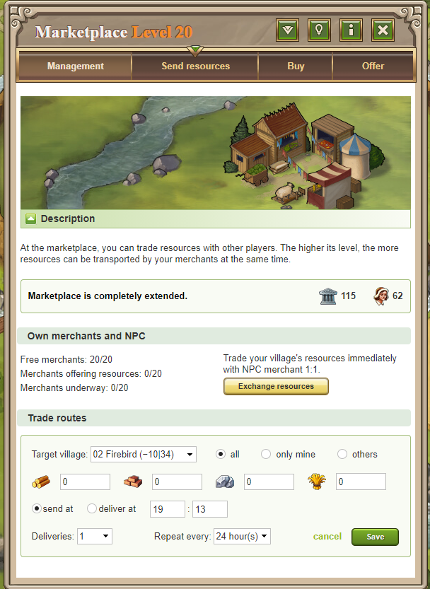

# Trade Routes

> Source: Travian: Legends Support  
> URL: https://support.travian.com/en/articles/60-trade-routes

---

**Trade Routes** are a [Gold Club feature](https://support.travian.com/articles/128) that let your merchants automatically transport resources between your villages at scheduled times. Once you have **more than one village**, you can access and configure trade routes through the **Marketplace**.

---

### How to Create a Trade Route

1. Go to your **Marketplace**.
2. Click **“Create a new trade route.”**
3. Fill in the details shown on the setup screen.

Here’s what each field means:

- **Target village:**
The destination for the resources.
You can only send resources using trade routes to **your own villages**, **Wonder of the World villages**, or **artifact villages** within your **alliance or confederacy**.
- **Resources:**
Choose how much **wood, clay, iron**, and **crop** to send.
- **Send at / Deliver at:**
Decide whether to set the **departure time** (when merchants leave) or the **arrival time** (when resources should arrive).
This allows for precise delivery timing, independent of distance.
- **Deliveries:**
How many times you want the merchant to make the trip.
- **Repeat:**
Choose how often the route should **repeat automatically** (e.g., every 4 hours, 12 hours, or 24 hours).

---

### How Duplication Works

When you create a trade route and set it to **repeat**, the game will automatically schedule duplicates based on your selected interval.

**Example:**
If you set a route to start at **04:00**, select **2 deliveries**, and choose **“Repeat every 4 hours,”**
the system will create routes at **04:00, 08:00, 12:00, 16:00, 20:00**, and **00:00**.

You can adjust existing trade routes anytime by clicking **“Edit.”**

---

### Managing Your Trade Routes

Once your routes are set up, you can view and manage them from the **“Management”** tab in the Marketplace.

You’ll see:

- The **start and delivery times** of each route.
- The **amount of resources** per trip.
- The **merchants used** and the **remaining time** for the next delivery.
- A **“3x1” notation**, meaning:

	- “3” = number of deliveries.
	- “1” = number of merchants used.

You can also:

- **Edit** a route.
- **Delete** a route (red ).
- Enable or disable specific trade routes using the **checkbox** in the last column.
