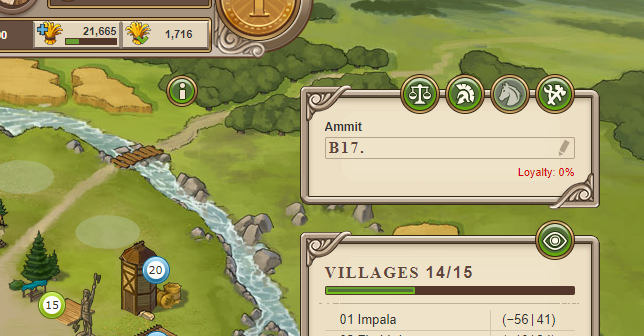

# Travian Plus Membership: Direct Links

> Source: Travian: Legends Support  
> URL: https://support.travian.com/en/articles/133-travian-plus-membership-direct-links

---

The **Direct Links** feature is part of [Travian Plus Membership](https://support.travian.com/articles/127). It provides quick access to your most frequently used buildings in the village.

---

### How It Works

When enabled, **Direct Links** appear on the **right-hand side** of your village interface.
They give you one-click access to these four main buildings:

- **Marketplace**
- **Barracks**
- **Stable**
- **Workshop**

> The links are only active if the respective building has already been constructed in the current village.

---

### Tip

This feature saves time by allowing you to quickly access key buildings without opening the main village view. It’s particularly useful during active play sessions when managing troop production or sending resources.
