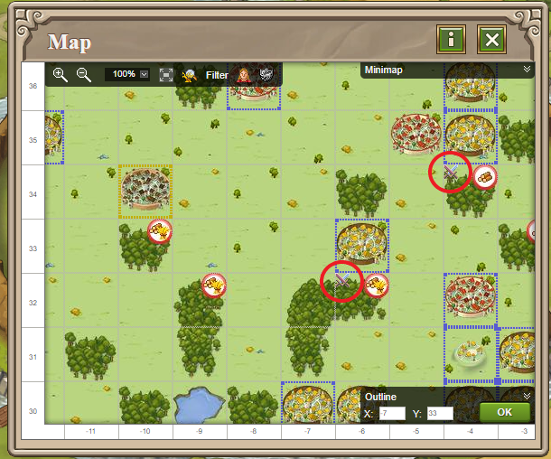

# Travian Plus Membership: Map - Incoming and outgoing troop movements

> Source: Travian: Legends Support  
> URL: https://support.travian.com/en/articles/135-travian-plus-membership-map-incoming-and-outgoing-troop-movements

---

The **Incoming and Outgoing Troop Movements** feature is part of the [Travian Plus Membership](https://support.travian.com//articles/127). It allows you to see your troop movements directly on the map — making it easier to monitor attacks, reinforcements, and scouting missions at a glance.

---

### How It Works

When your troops are moving, you’ll see small icons in the **upper left corner** of the map fields.
These icons indicate different types of activity related to your villages or oases:

- **Red sword:** Troops are attacking or being attacked.
- **Yellow shield:** Troops are leaving your village as reinforcements.
- **Green shield:** Your troops are currently stationed in that location as reinforcements.
- **Spyglass:** Spies are traveling to scout the selected target.

---

### Tip

This feature is especially useful during times of heavy troop movement, as it helps you quickly identify which villages are under attack or involved in reinforcements — without needing to open each report individually.
