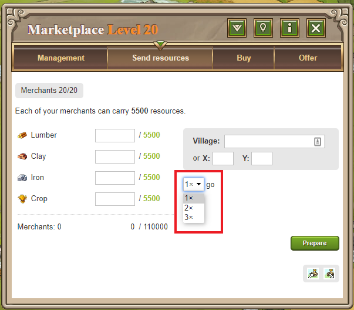

# Travian Plus Membership: Merchant run twice

> Source: Travian: Legends Support  
> URL: https://support.travian.com/en/articles/131-travian-plus-membership-merchant-run-twice

---

The **Merchant Run Twice** feature is part of [Travian Plus Membership](https://support.travian.com/articles/127). It allows your merchants to automatically make **two consecutive trips** to the same target village with the same amount of resources.

---

### How to Use

1. Go to your **Marketplace** and open the **Send Resources** tab.
2. Enter the amount of resources and the target coordinates.
3. Below the coordinate fields, choose **“2×”** from the dropdown menu.
4. Your merchants will deliver the resources twice in a row automatically.

---

### Tip

This feature is especially helpful for players frequently sending resources between their own villages or to alliance members, as it saves time and reduces repeated manual actions.
