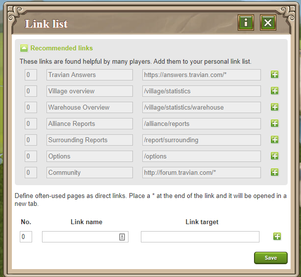

# Travian Plus Membership: User defined links

> Source: Travian: Legends Support  
> URL: https://support.travian.com/en/articles/134-travian-plus-membership-user-defined-links

---

The **User Defined Links** feature is part of the [**Travian Plus**](https://support.travian.com/support/solutions/articles/7000060367) . It allows you to create your own shortcuts to in-game or external pages, displayed on the **left-hand side** of your village interface.

---

### How to Add or Edit Links

1. Click the **green pen icon** in the top-right corner of the **Link List** panel.
2. To add one of the **recommended links**, click the **green plus (+)** next to it.
3. To add your own custom link, scroll to the bottom of the list and use the empty fields provided.

Each link has three editable fields:

- **No:** Sets the display order of the link.
- **Name:** The title that appears in your Link List panel.
- **Link:** The target address of the page.

	- You can link to **any page**, including in-game pages (e.g., `/village/statistics`).
	- Adding an **“***” at the end of the link opens it in a new browser tab.

You can add or delete a row using the **+** or **–** buttons at the end of each line.
Changes are saved automatically when you click **Save**.

---

### Tip

Use this feature to quickly access your favorite in-game pages or community tools — saving time during daily play.
