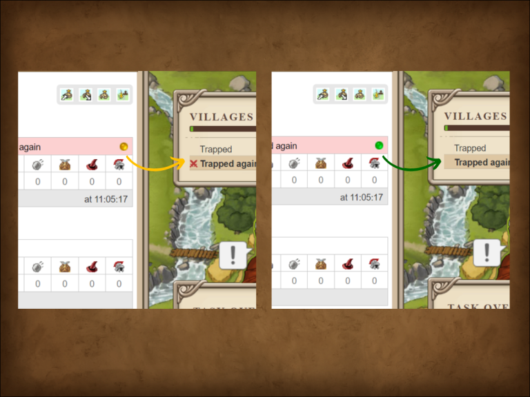

# Travian Plus Membership: Village List Attack Notifications

> Source: Travian: Legends Support  
> URL: https://support.travian.com/en/articles/137-travian-plus-membership-village-list-attack-notifications

---

The **Village List Attack Notifications** feature is part of the [Travian Plus Membership](https://support.travian.com/articles/127). It improves how incoming attacks are displayed, helping you focus on the most relevant threats.

---

### How It Works

When this feature is active, **attacks marked with a green dot** in your **Rally Point** will **no longer appear as sword icons** in the village list. This helps you keep your overview clean — you’ll only see attack indicators for unmarked or newly incoming attacks.

---

### Tip

Use this feature to reduce clutter when managing multiple villages or when you already know which attacks are being handled. It’s particularly helpful during coordinated defenses or heavy battle activity.
