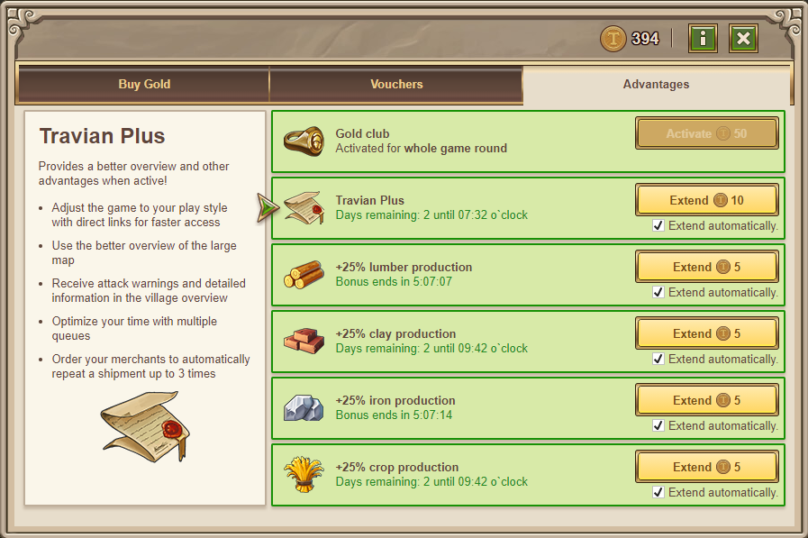

# Travian Plus Membership

> Source: Travian: Legends Support  
> URL: https://support.travian.com/en/articles/127-travian-plus-membership

---

**Travian Plus** **Membership** offers convenient tools and interface improvements to help you manage your villages more efficiently. It can be purchased with **Gold** and remains active for a limited number of days, depending on the server speed.

---

### Activation and Duration

You can buy Travian Plus for:

- **7 days for 10 Gold** on **1x speed servers**.
- **3 days for 10 Gold** on **2x or faster servers**.

When your Plus time runs out, you can renew it by purchasing it again or enabling the **“Extend automatically”** option.

---

### Details

Travian Plus Membership includes several powerful features to improve gameplay efficiency and overview:

- **Notepad** – Keep personal notes and reminders in-game.
- [Direct Links](https://support.travian.com/articles/133) – Add quick-access links to important game sections.
- [User-defined links](https://support.travian.com/articles/134) – Create your own shortcuts for frequently used pages.
- [Larger map](https://support.travian.com/articles/130) – View an expanded version of the map for better navigation.
- **Attack warnings and detailed overview** – See incoming attacks and important updates more clearly.
- [Central Village Overview](https://support.travian.com/articles/42) – Get an organized summary of your village production, buildings, and activities.
- [Merchant run twice](https://support.travian.com/articles/131) – Each merchant can complete two trade runs per order.
- [Building and Research Waiting Loop](https://support.travian.com/articles/34) – Queue multiple construction or research tasks for smoother progress.

---

### Tip

Enabling the **“Extend automatically”** option ensures your Plus membership continues without interruption, so you never lose access to its benefits.

