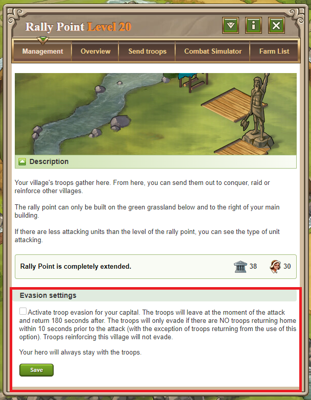

# Troop Evasion

> Source: Travian: Legends Support  
> URL: https://support.travian.com/en/articles/15-troop-evasion

---

Troop Evasion is a [Gold Club feature](https://support.travian.com/articles/128) that allows you to automatically protect the troops trained in your **capital** by letting them evade incoming attacks. When enabled, your troops will **leave the village at the exact moment an attack lands** and will return **180 seconds later**. Troops will only evade if **no troops are returning home within 10 seconds** before the attack arrives. The only exception is troops returning from a previous evasion triggered by this feature. Reinforcement troops stationed in the village **do not** evade.

---

## **How to Activate Troop Evasion**

1. Open your **Rally Point**.
2. Go to the **Management** tab.
3. Find the **Evasion settings** section.
4. Tick **“activate troop evasion for your capital.”**
5. Click **Save** to confirm.

Only troops trained in that village will evade. Reinforcements from other villages will not.

