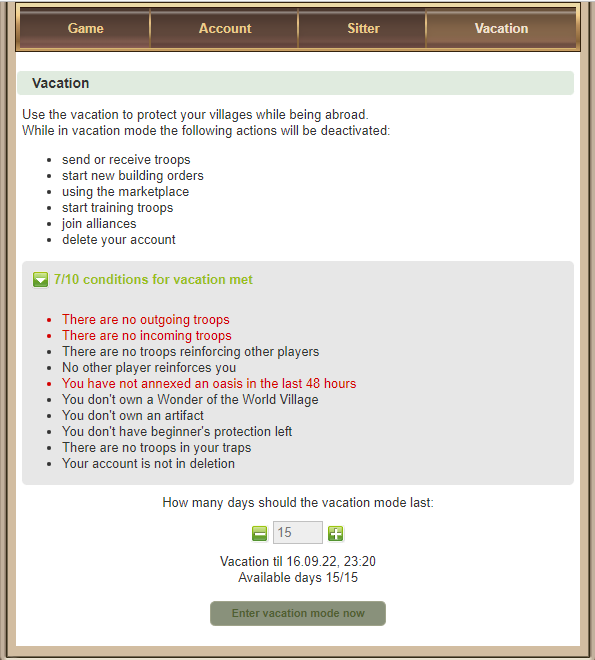

# Vacation Mode

> Source: Travian: Legends Support  
> URL: https://support.travian.com/en/articles/61-vacation-mode

---

### What is Vacation Mode?

If you need to take a break from the game and **cannot use sitters**, you can activate **Vacation Mode** in your **Preferences**.
This feature protects your villages while you’re away, but it also limits most in-game actions.

You can activate Vacation Mode for a **minimum of 1 day** and a **maximum of 15 days**, depending on server speed.

> The formula is **15 ÷ speed**.
> For example, on a **speed x2** server, you can use up to **8 days** (15 ÷ 2 = 7.5, rounded up).

---

### How to Activate Vacation Mode

1. Open your **Preferences** page.
2. Go to the **Vacation** tab.
3. Make sure all **conditions** are met (any unmet ones are shown in red).
4. Use the **+ / –** buttons to choose how many vacation days to activate.
5. Click **Enter Vacation Mode Now**.

> Once vacation mode starts, you cannot change its length.
> You may **abort vacation early** for **10 Gold**, but only after the first **12 hours**.
> Unused days will be refunded.

---

### Conditions to Activate Vacation Mode

Before you can start vacation, you must meet all of the following conditions:

- No outgoing troops.
- No incoming troops to your villages or oases.
- No reinforcing troops sent to other players.
- No reinforcing troops from other players in your villages or oases.
- No ownership of a **Wonder of the World** village.
- No ownership of an **artifact** village.
- No **beginner’s protection**.
- No **troops in traps**.
- Your avatar is **not marked for deletion**.
- You have **not annexed an oasis** in the last 48 hours.

> You can enter vacation mode once 48 hours have passed since annexing an oasis or after losing it.

---

### What Happens During Vacation

Once activated, your villages are **protected**:

- Other players **cannot attack or raid you**.
- Players can **see** that you are in vacation mode.
- Your villages **may still appear on raid lists**, but attacks will **not reach you**.

However, your **troops can still starve**, so plan your crop balance before enabling vacation mode.

---

### Actions You Cannot Perform

While on vacation, you cannot:

- Send or receive troops.
- Go on adventures with your hero.
- Start new building orders *(existing ones will continue, including with Master Builder)*.
- Train troops.
- Start celebrations or parties.
- Use the marketplace *(except NPC trade, which still works)*.
- Start research in the Academy or upgrades in the Smithy.
- Use auctions.
- Join or create a new alliance.
- Start avatar deletion.
- Set up or run trade routes *(they stop automatically)*.
- Open the alliance bonus donation page.

---

### Actions You Can Still Perform

You can still:

- **Abort vacation mode** using **Gold** (after 12 hours).
- **Use resources** from your hero’s inventory.
- **Exchange silver for gold**.

---

### Additional Information

- You can start a new vacation only **12 hours after** the previous one ends.
- **Daily Rewards** reset as usual during vacation.
- Actions started **before vacation** (e.g. troop training or construction) will **continue normally**.
- **Trade routes** will stop running.
- The **infobox** will show a message confirming vacation mode and include a link to abort it.
- **Automatic deletion due to inactivity** does not occur during vacation mode.
