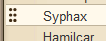
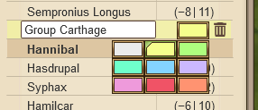

# Village List groups

> Source: Travian: Legends Support  
> URL: https://support.travian.com/en/articles/44-village-list-groups

---

The **Village List Groups** feature lets you **organize your villages into sections** for a clearer overview and easier management — perfect for players with many villages.

---

## Availability

> This feature is **only available on certain gameworlds**.
> Editable groups are available on gameworlds that started on or after **January 8, 2025**.

---

## Creating Groups

1. Click the **folder icon** next to the village group counter to create a new group.
2. Enter a **group name** and confirm.

---

## Adding and Moving Villages

**Drag and drop** villages into a group or move them between groups.

- You can also rearrange the order of villages and groups the same way.
- Grab a village by the **six-dot handle** shown next to its name to move it.

---

## Editing Groups

Click the **pencil icon** next to a group to:

- Rename it.
- Choose a **color** for easier visual separation.
- **Delete** the group.

If you delete a group, its villages are automatically moved **outside all groups**.

---

## Minimizing Groups

Use the **arrow button** next to a group name to **minimize or expand** it — hiding or showing its villages.

---

**Tip:**
Group your villages by purpose — for example, "Offense," "Defense," "Resource," or "Support" — to find and manage them faster during hectic gameplay.
