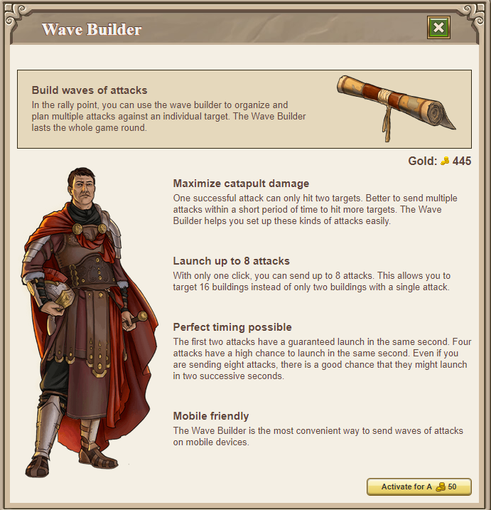

# Wave Builder

> Source: Travian: Legends Support  
> URL: https://support.travian.com/en/articles/136-wave-builder

---

The Wave Builder is a premium feature that you can activate individually in each village. It allows you to organize and send multiple attacks that launch within the same second. This helps you coordinate precise attack waves more easily, especially when timing is critical.

---

## What the Wave Builder Does

In the Rally Point, the Wave Builder lets you prepare up to **8 attacks** against the same target on a single screen. This makes it possible to:

- Coordinate waves intended to hit multiple buildings quickly
- Plan catapult waves to maximize damage
- Improve timing accuracy across several attacks
- Use the feature conveniently on both desktop and mobile (as shown in the image on page 1)

Only one click is required to launch all prepared attacks.

---

## Timing and Attack Behavior

The game has a **hard limit of 4 attacks per second** from a single village. The Wave Builder is designed around this limit and aims to send 4 waves in the same second with around **80% chance**.

Because of this limit:

- If you send more than 4 attacks, they will usually land across **two or more seconds**, depending on how the system distributes them.
- The examples shown on page 2 illustrate possible outcomes with detailed percentages.

### Examples

- **1 wave of 3 attacks**

	- 90% chance all 3 land in the same second
	- 10% chance they split into 2 seconds
- **1 wave of 4 attacks**

	- 81% chance all 4 land in the same second
	- 19% chance they split
- **2 waves of 4 attacks (8 attacks total)**

	- 65% chance they split as 4+4 seconds
	- The remaining outcomes are distributed across 3 or more seconds (multiple variants shown)

These distributions are based on **10k simulation attempts per example**.

---

## Additional Information

Even without the Wave Builder, experienced players may attempt same-second waves using browser tabs and the online/offline send technique. However:

- The server checks for more than 4 attacks sent in the same second every **15 minutes** and may cancel additional waves.
- If the **travel time is below 15 minutes**, it remains possible for more waves to arrive in the same second.
- Skilled players can adjust **Tournament Square levels** to manipulate arrival times and attempt to group waves more closely - even across multiple villages.

---

## Cost and Duration

- Activation costs **50 Gold per village**.
- Once activated in a village, it remains active for the **entire game world**.

---

## What Happens if the Village Is Conquered?

- If another player conquers a village that has the Wave Builder, the feature is **disabled** and does **not** automatically reactivate.
- If **you** conquer the village back, you must purchase the feature again.
- Conquering **your own** village does **not** deactivate the Wave Builder.
