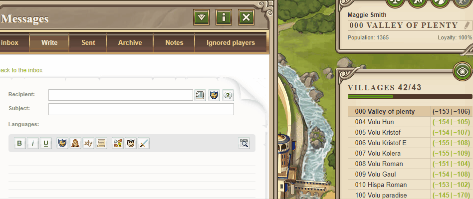

# 5 small useful things you might have missed about Travian: Legends

> Source: Unofficial Travian  
> URL: https://unofficialtravian.com/2025/01/12/5-small-useful-things-you-might-have-missed-about-travian-legends/

---

Welcome to [**Thursday guides**](https://blog.travian.com/tag/thursday-guides/) series

Vinsent Van Gogh once said: *“Great things are done by a series of small things brought together.”*

Today we would like to share with you a few small, but useful  things about Travian: Legends game that will help in your account development.

#### **I Scout operations count for the daily quests**

In order to complete daily quests “Raid an unoccupied oasis” and “Raid/attack a Natarian village” it’s enough to **send 1 scout** to any unoccupied oasis and to any independent Natar village. If you have a farmlist enabled, it makes sense to add closest Natars and oases and complete those quests fast and easy.

#### **II Inserting coordinates into X or Y**

In order to insert coordinates into the game it’s enough to paste them into either X or Y entry field. The game will automatically recognize it.

#### **III Shortcuts for ingame messages**

Lots of players know that if you click on the village coordinates in your village list (with Travian Plus feature enabled) the game automatically inserts those coordinates into the marketplace and into the Rally Point. This also works for the ingame messages. Just click on the coordinates to add them directly into the message with the needed bb-codes.**????️Click here????️ to see the explaining gif**

####

#### **IV Huns “Hamvil” calculator**

Kirilloid calculator has a hidden section where you can calculate the offensive strength of a Hun Hamvil.  Hamvil is an acronym from hammer (attacking army) and anvil (defensive army) and is used for armies that is effective in attack and at the same time can be used in defense. One of the most prominent “Hamvils” in the game is a Mercenary-Marksmen Hun Army. Offense Calculator with marksmen can be found [**here**](http://travian.kirilloid.ru/off_calc2.php#b=20,0,20,0,0&r=7&t=1&s=1.432&po&art=100).

#### **V Easy guide about capital resource development**

A tool that helps developing your capital cropper village in an optimal order (resource wise). Extended cropper development calculator also gives suggestions when it’s best to build Townhall 20 and upgrade to the city for the gameworlds where this feature is present. The cropper development calculator is [**here**](https://blog.travian.com/wp-content/uploads/2024/10/Travian-Cropper-development-calculator.html).