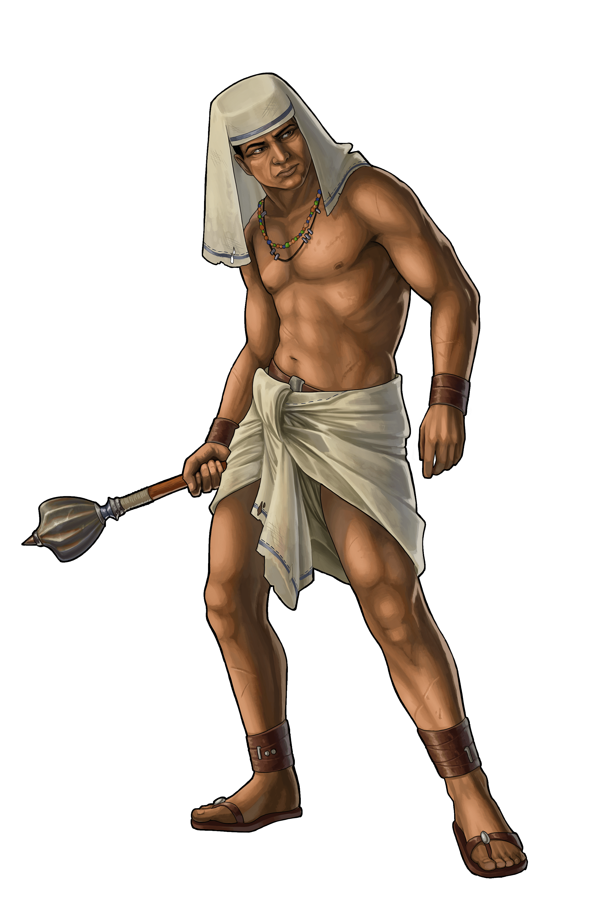

# 5 things to consider about Egyptians

> Source: Unofficial Travian  
> URL: https://unofficialtravian.com/2025/01/08/5-things-to-consider-about-egyptians/  
> Written on March 30, 2023

---

*There was one particular Egyptian village ruler that worried about everything possible. However, one day he came into the tavern whistling with a smile on his face. The other village rulers noticed that he looked more relaxed than ever.*

*“What happened? You seem in a good mood.”*

*He replied, “I’m paying a counsellor to do all my worrying for me.”*

*“Well, how much are you paying him?”*

*“Two thousand gold coins a week,” he replied.*

*“What? How can you afford that?!”*

*“I can’t,” he said, “but that’s his worry now.”*

*An ancient Egyptian joke*

**First of all, Egyptians are great economists and this is what comes as their main strength when we talk about them**.

Let’s look into 5 more things to consider about Egyptians.

???? Egyptian usual style of playing can be put down to 2 main features: flourishing economy and focus on defence rather than offence.

Egyptians unique building – [Waterworks](http://travian.kirilloid.ru/build.php#b=45&mb=1&s=1.46) – increases oasis bonus by 5% per level and defines where they should settle for their main strength. Some good rich soils surrounded by various oases is the best spot for them. Please, note, that on gameworlds with a city feature (Annual Special and such) the Egyptians can build waterworks only in [cities](https://support.travian.com/en/support/solutions/articles/7000066485-special-servers-cities), while on regular gameworlds it’s possible in every village which has a Hero mansion level 10.

???????? Slave militia, the base Egyptian unit, is worth special mentioning. Players still can’t come to a common ground about it. [**Slave militia**](http://travian.kirilloid.ru/war.php#s=1.432&params=8&stat_sum=6&func=cu%2Ft)**is the fastest trained and cheapest defence unit among all of the tribes, overpowering even phalanx on that matter.**Their downside is crop consumption, which might be quite high since you need to train lots of units to increase def numbers.

That’s why**it’s not wise to train slave militia for stationary****defence**, especially World Wonder defence due to their high crop consumption in comparison to their defence values. However, when feeding is not an issue (which is a more common case in speed gameworlds) or when the fight is so intense that slave militia are not supposed to get fed for long, this is a really great defensive unit.

???????????? If we talk about late defence, it makes sense to focus on [**Ash Warden and Resheph Chariots**](http://travian.kirilloid.ru/troops.php#s=1.432&tribe=6) for an Anvil (*author’s note: usual term for a defensive army*). Ash Warden is a strong anti-infantry unit, while Resheph Chariots have better anti-cavalry defence values. That’s why this combination makes the Egyptian defence more universal and best suited against any form of attacks.

???????????????? Being defensive at its core, Egyptians have weaker attacking units in general, and their attacking army (Hammer) is longer trained compared to the other tribes. The Egyptian army however has a very good advantage in comparison to those belonging to pure aggressive tribes. Being average in attack, Khopesh Warrior – Resheph Chariot hammer is very resistant to killing in defence due to their high defensive values. You can sleep happily as not many offensive players would dare to attack your army during the night without rams!

???????????????????? And last but not the least. In general, Egyptians are more of a mid-game tribe rather than early one and require some knowledge and good calculations of how to use their strength the best way. If the situation on a gameworld allows you, and you do not have highly aggressive neighbours around, **focus on the economy as long as possible, leaving the warfare for later times**. Once you establish a good economy and will have at least one (more is better) fully developed village, you can start training troops for protection. Use the Egyptian hero ability wisely: increased resource bonus during early game gives a nice advantage for players and allows them to compete for the best spots on the map with other tribes.

All in all Egyptians are a good choice for the players that already have some basic knowledge about the game. Their game start might not be the easiest and they require some time to develop their account in peace. At later stages Egyptians become a strong force due to their better economy.