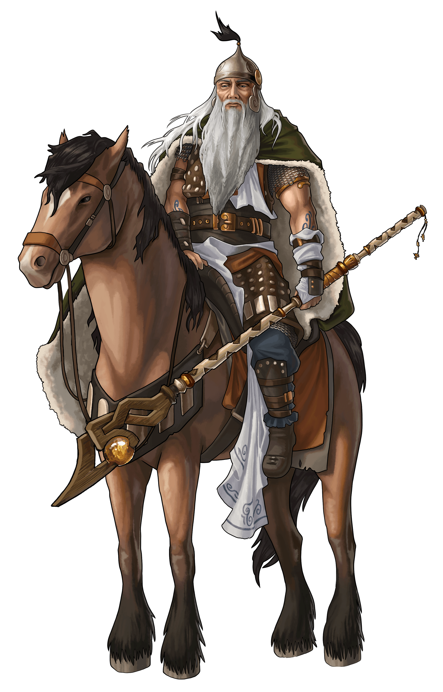
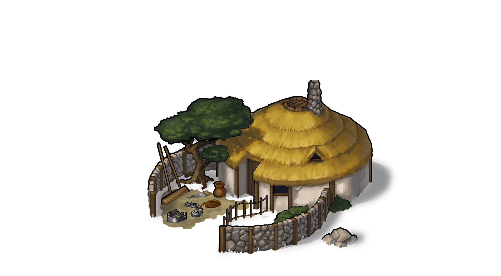
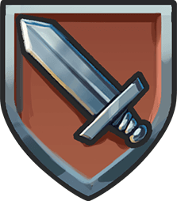
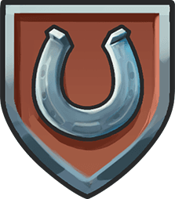

# 5 things to consider about Gauls

> Source: Unofficial Travian  
> URL: https://unofficialtravian.com/2025/01/09/5-things-to-consider-about-gauls/  
> Written on March 9, 2023

---

*A village head comes to the trapper and says angrily: “Today I walked around our village and I haven’t seen a single trap out there!” “Thank you, sir”, the trapper replied, “I did my best”.*

From the very start of the game and up until now Gauls are a great tribe for new players and for those who prefer to **mainly play defensive**. Let’s look at 5 important things that we should consider about Gauls.

???? **Gauls are the best tribe to have a smooth and peaceful start of the game.**Their crannies are 1.5x bigger than those from the other tribes. Gauls have one of the**most balanced defences** in the game, and they are able to fight successfully against enemy infantry and cavalry on their own. On top of that, Gauls have one of the best early-game defence buildings in the game – the [**Trapper**](https://support.travian.com/en/support/solutions/articles/7000065346-trapper).

???? ???? The [**Trapper**](https://support.travian.com/en/support/solutions/articles/7000065346-trapper) deserves a separate point, though. Some players look down on it, mainly due to it being less important for the mid and late game, but barely anyone argues that early game the [**Trapper**](https://support.travian.com/en/support/solutions/articles/7000065346-trapper)  plays an important role in the Gaul’s development.

This building is quite cheap and has minimal pre-requirements, 25% of the trapped units will be killed even if the enemy attack is successful and they won’t even end up in the hospital.

One of the most important things to consider about traps and Trappers is that**they are*****invisible in scout reports***. You may not have any Trapper at all in your village, and yet**the mere possibility that as a Gaul you*****MIGHT*****have a Trapper and traps scares most of the early farmers off,** and gives you enough time to develop your economy and prepare for the future battles.

???? ???? ???? Gauls base unit – [**Phalanx**](http://travian.kirilloid.ru/troops.php#s=1.432&tribe=3&s_lvl=1&t_lvl=1&unit=1) – is one of the best defensive infantry units in the game. It shows good results both against infantry ( 40) and cavalry ( 50). The phalanx is fast trained and costs only 315 resources in total. Combined with the druidriders, one of the fastest and best anti-infantry units, Gauls can proudly take the role of a universal defensive well-trained-single-tribe squad.

???? ???? ???? ???? Even though Gauls are mainly trained to defend rather than perform massive off operations, they can easily turn to **offence**later in the game. **[Theutates Thunders](http://travian.kirilloid.ru/troops.php#s=1.432&tribe=3&s_lvl=1&t_lvl=1&unit=4)** for farming and quick lightning attacks on sleepy harrisons, **[Swordsmen](http://travian.kirilloid.ru/troops.php#s=1.432&tribe=3&s_lvl=1&t_lvl=1&unit=2)** and **[Haeduans](http://travian.kirilloid.ru/troops.php#s=1.432&tribe=3&s_lvl=1&t_lvl=1&unit=6)**  for breaking through the enemy defence. It’s worth mentioning though that Gallic Rams are the weakest out of all other tribes and take the longest time to get trained. **The destiny of a World Wonder Rammer is not for Gauls**, therefore. Gaul offensive cavalry – **[Haeduans](http://travian.kirilloid.ru/troops.php#s=1.432&tribe=3&s_lvl=1&t_lvl=1&unit=6)** – is a formidable opponent in defence with their  165 base defence against cavalry, which lets Gauls not to worry too much about sudden cavalry attacks on their idling troops.

???? ???? ???? ???? ???? Planning is key. This is true for any tribe, but since Gauls are more often picked by the newer players, it’s worth repeating. Always balance the economy with unit training. **Training defence in every village is not the best option.**

You just won’t have enough resources to upgrade your troops, build a Tournament Square, max up Barracks, Stables, Smithy, Hospital and at the same time keep developing your account and other villages.**Training troops non-stop (both druidriders and phalanx) in every 4th village give or take is something that is advisable for the Gaul defender.**Of course, after you get more experience you can adjust this ratio based on the resources you have and your alliance goals.

A good result gives a combination of a Theutates Thunders’ village that is used to farm and to gain resources with the multiple defensive villages.

To sum up,**Gauls**, being one of the most peaceful tribes that have a variety of defensive tools,**is**a**good choice for the new players**. And still even veteran pro defenders often pick Gauls for their speed, all-round defence and sense of independence the Gauls provide.