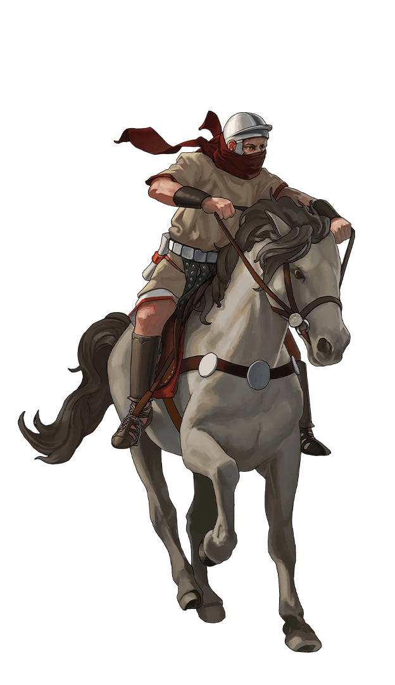

# 5 things to consider about Romans

> Source: Unofficial Travian  
> URL: https://unofficialtravian.com/2025/01/08/5-things-to-consider-about-romans/  
> Written on March 16, 2023

---

*What’s the worst thing you could say to insult a Roman?*

*“I thought you had to be in relatively good shape to join the Roman army.”*

*(с) An ancient joke*

#####

By design, Romans are a synonym of discipline, order and strength. So, let’s look into 5 things we should consider if we picked Romans as a tribe in Travian: Legends.

????First and utmost – **Romans are very good in development**. Their unique ability to construct internal buildings in parallel with the resource fields make development of any Roman village fast and efficient. Isn’t it a dream to build Main building, warehouses and granaries while you are upgrading fields? **They are natural time and gold-savers.**

???????? **Horse Drinking Trough adds another huge bonus that is hard to underestimate.** Roman Equites Legati considered best scout units if we talk about crop consumption vs speed vs training costs. That is the only horse rider unit in the game that consumes just one crop per hour without any diet artefact or world wonder effects. That’s why **players that picked alliance scouter as their game specialisation often play with the Romans**.

???????????? Whether you play on a 3-tribe, 5-tribe or a 6-tribe world, you know for sure that in general alliances have more defence against infantry than against cavalry. And this gives another benefit to the strong Roman army which is more focused on cavalry than infantry.

**Training time of Equites Caesaris (strongest Roman cavalry) with 20 lvl Horse Drinking Trough is just about 1.4x longer than training of an Imperian.** Equites Imperatoris – well-balanced farming unit has relatively good speed and good carrying capacity.

???????????????? **Romans are natural World Wonder killers.** Roman Fire catapults are the strongest among all tribes, Roman army is highly crop-efficient, and, combined with quite fast development, it gives players the option to participate in the ultimate battle for the World Wonders. Mid and endgame is where Romans really come to power!

???????????????????? **Speaking about Romans, we can’t avoid mentioning their defence.** Roman base units – Legionnaires might not be best ones for early farm, yet in addition to attack value, they provide average defence against infantry and rather good defence against cavalry. Being all-rounders, the legionnaire costs and training times are not the lowest, though. Praetorian guards are best anti-infantry units on a 3-tribe gameworld, and above average on 6-tribes. Their major weakness is their speed. That’s why they are better suited for stationary defence than for mobile urgent one.

All in all, Romans would be a good choice for the players that do not plan to spend lots of gold for the game. Romans need some time to come to real power at the beginning of the round, but in the mid- and end-round Romans become a strong force to be reckoned with!