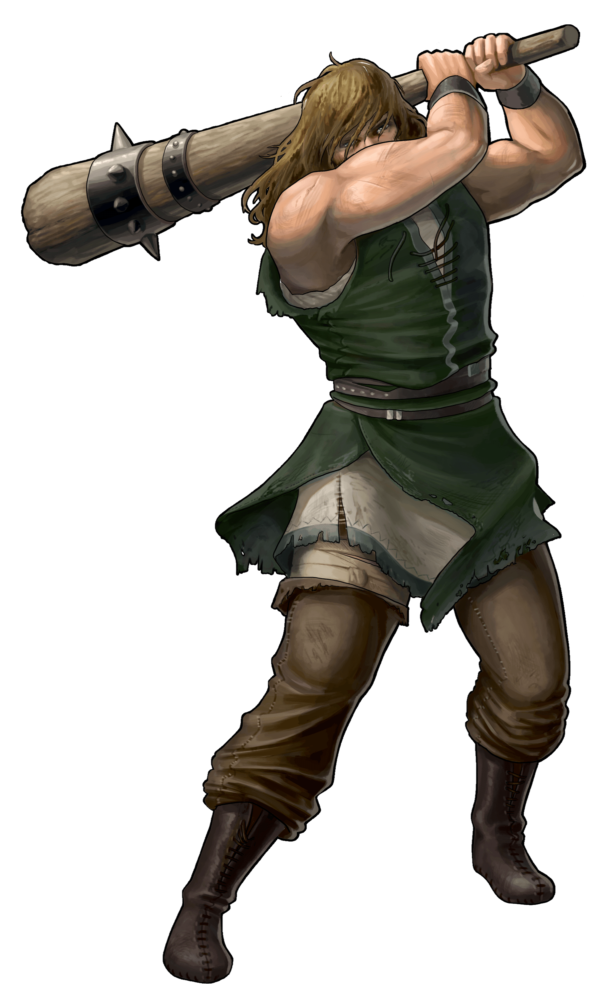

# 5 things to consider about Teutons

> Source: Unofficial Travian  
> URL: https://unofficialtravian.com/2025/01/09/5-things-to-consider-about-teutons/  
> Written on March 2, 2023

---

*A tired, covered with mud, Teuton approaches the alliance leader and smiles happily. “Greetings, sir! Congratulate me! I successfully defeated our enemies in the North-East!” The leader looks back at him with horror in his eyes: “But… but… – he says in a weak voice. – So far we didn’t have enemies in the North-East!”*

*The Teuton smiles even more happily and answers: “Now we have them!”*

##### **So, when choosing Teutons, what are the 5 most important things you need to consider?**

Basically, this is the first thing you need to consider about Teutons. By design Teutons are a rather**aggressive tribe and they are born to cast fear into the hearts of the enemies**.

???? Their **base attacking infantry** –[**clubswingers**](http://travian.kirilloid.ru/troops.php#s=1.46&tribe=2&s_lvl=1&t_lvl=1&unit=1) – is one of the best in the game. Due to being rather cheap they can grow considerable armies early enough and defeat surroundings pretty fast. But with this strength comes the first weakness. If you pick Teutons you need to be extra careful and watch closely and react fast to enemy cavalry attacks. Send them to distant oases when you go offline for longer times, activate evasion, and never leave them idling at home!

???????? If for some reason you decided that an **aggressive style is not for you**, and you prefer to play **defencive**, Teutons will give you that opportunity. Their [**Spearmen**](http://travian.kirilloid.ru/troops.php#s=1.46&tribe=2&s_lvl=1&t_lvl=1&unit=2) are still the best**anti-cavalry units** in the game. Focus on them. **Do not waste resources on paladins**. They are not that great in terms of defence value vs costs vs crop consumption.

???????????? Teutons have a unique tribe building – **[Brewery](https://support.travian.com/en/support/solutions/articles/7000065345-brewery).**This is the only tribe specific building which can only be built in the capital and has an account-wide effect. It will make your troops 20% stronger (at maximum level), which is useful not only when you go on attacks. The Brewery effect will reduce your losses from farming and eventually you will need less troops per every farm entry. Remember, the Brewery effect is counted at the time when the attack lands, not when it was launched. The strength comes hand in hand with some weaknesses, though, which are less persuasive chiefs and catapults aiming only random targets. Pick the times when you enable the Brewery celebration wisely!

???????????????? In the mid and late game in alliance operations **Teuton hammers** are often used as a **cleaner****to break through the defence**. This is no wonder. This is a combination of 3 factors: one of the strongest rams in terms of attack strength (Egyptians, Gauls and Romans have weaker rams), fastest training speed among all tribes, 20% more strength due to the Brewery effect – all of this makes Teuton rams **the best wall-breakers in the game**. On top of that, fast and cheap clubswinger recovery in a hospital combined with impressive training speed lets experienced Teutons be on top of attack rankings.

???????????????????? Last but not the least. **Despite being cheap, a Teuton army requires lots of resources to get trained, and later even more to get fed.** Balance your troop numbers with your **economy** to reach the best results. Align with alliance leadership the role you would like to perform and focus on that.

And you will shine!