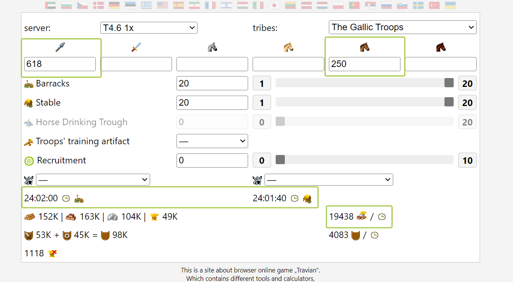
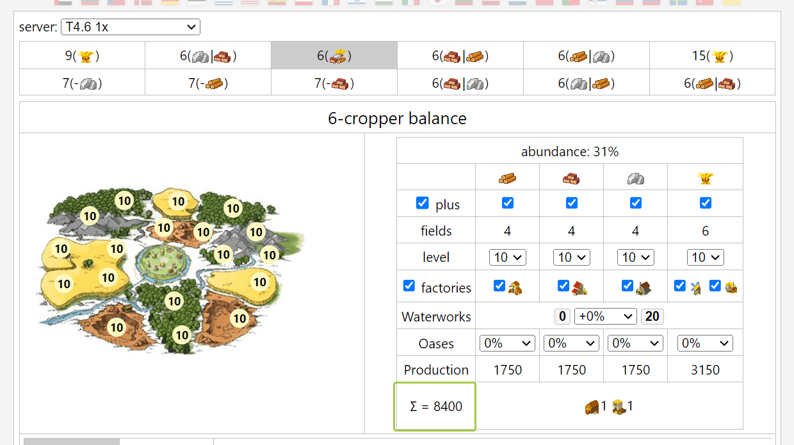

# Defense account ~ Balancing Military and Economy

> Source: Unofficial Travian  
> URL: https://unofficialtravian.com/2025/01/11/defense-account-balancing-military-and-economy/  
> Written on November 22, 2023

---

Welcome to the **Game Secrets** series. Today, we will talk about the defensive account economy.

*In this guide, we will cover most straightforward and resource-efficient way of managing regular defence account, meaning that we won’t cover “edge cases” when account works for World Wonder (and therefore trains defence in every village, ignoring “support buildings” like Tournament Square) as well as “fast def anvils” (like druid-only-early game big pack anvil which is pushed by the whole alliance to provide fast def against early armies and might use Great Stables for better production).*

***Most effective defensive players in the game are those who mastered balancing economy and military development.***

**In one of [the early guides](https://blog.travian.com/2023/04/developing-your-first-villages/) we gave advice that economy should always come first.** It’s quite a common mistake when players have too many resources that they have nowhere to use. Another even more common mistake is that players start too many projects on their accounts and struggle with them due to lack of resources.

##### **How to balance military development vs economy?**

- An average **fully developed “regular resource” village** costs around 4 – 4.5 millions of resources in total. This includes full economic development and necessary [**passive culture points**](https://blog.travian.com/2023/10/game-secrets-culture-points/)
- **Defense village** costs almost twice as much, from 7.5 to 8 million of resources due to Hospital, Barracks, Stables, Smithy, Tournament square and Smithy upgrades.
- **Offensive village**will cost 10+ million resources, but it will be a topic for the separate blog post.

**Let’s take Gaul defensive village as an example and calculate the costs.**

###### **Gaul defense village investments in detail**

| **Expenses** | **Costs in total (approx.)** |
| --- | --- |
| **Resource development** | |
| All resource fields to lvl 10, all resource buildings to lvl 5 | 1350000 |
| **Infrastructure development** | |
| Main building 20 | 93915 |
| Residence 20 | 775920 |
| Warehouse 20 x2 | 207570 x2 |
| Granary 20 x2 | 133440 x2 |
| Marketplace 20 | 168030 |
| Trade office 10 | 167100 |
| Townhall 10 | 162875 |
| Palisade 20 | 197680 |
| Rally point 20 | 212520 |
| Other possible buildings (Hero’s Mansion, Embassy, extra Granary, Academy, Treasury etc.) | 500000 |
| **Cost of resource and infrastructure development** | **4310060** |
| **Military defense development** | |
| Barracks 20 | 360785 |
| Stables 20 | 355840 |
| Tournament square 15 | 815315 |
| Hospital 15 | 194995 (682020for lvl 20) |
| Smithy 20 | 538690 |
| **Smithy Upgrade costs** | |
| Phalanx 0-20 | 352465 |
| Druidrider 0-20 | 522010 |
| **Cost of military development** | **3140100** |
| **Total cost of the defense village** | **7450160** |

So, getting fully ready for defense village is quite an **expensive task**, especially for the early game when resources are still scarce.

##### **How many resources needed for keeping the queues?**

Now let’s look at how many resources you will need for keeping queues in barracks and stables non-stop.

In this post we will take strictly **basic numbers (no helmets, no recruitment bonus)** to give a general idea of the costs. With bonuses, helmets and training artifacts the numbers will be different. For more precise calculations of your costs you can use defense calculator **[here](http://travian.kirilloid.ru/def_calc.php#r=2&v=1.46&u=618,,,,250&b=20&s=20)**.

**Kirilloid defense calculator gives us those approximate numbers:**

**For 24 hours on a x1 gameworld you will be able to train 618 phalanx and 250 druidriders.** If you want to keep queues non-stop in your fully developed defense village, you will need approximately 152+163+104+49 = **468k (468000) resources a day or 19438 per hour**.

##### **Where do I get those resources?**

**A regular resource village production (with bonuses) is ~8400 resources per hour** (a bit more if village has an oasis minus village population).

Normally we advise **keeping 40% of each village production for further development** and regular expenses (for example, Townhall celebrations, developing passive culture point buildings and supplying other villages). That leaves us around 5000 resources per village that we can use for keeping queues non-stop.

**That gives us the result:**

***One fully upgraded defense village needs additional 3 fully upgraded support villages to keep 24/7 queues in this village.***

##### **What about the capital****?**

At least 1/4th of the game round duration (or even longer) the capital works on its own development. High level cropfields and necessary infrastructure cost a lot of resources. After that, based on resource production of your capital, it can be used for feeding the troops and work as additional defense village as well as resource base for fast losses recovery.

##### **Some last moment tips and tricks**

- **4-village cluster (1 defense + 3 suppliers) works well for the defense account on any speed**, not just x1.
- After you develop your capital, you can **consider adding more defense villages near your capital** for the extra resources it will produce.
- **You don’t need to fully develop your defense village before you start training** defense there. Some players first upgrade barracks and stables to level 20, then slowly upgrade the needed infrastructure and do the Smithy upgrades.
- For more information about balancing troops vs smithy upgrades you can look [**here**](https://blog.travian.com/2023/11/game-secrets-more-troops-or-smithy-upgrades/).
- In general, it’s recommended to keep your defense villages in **close proximity to the capital.** When it’s not possible (for example, due to cluster settling on Annual special gameworlds in different regions), it’s recommended to try keeping clusters of 4 nearby villages one of which is defense.
- **Trade routes is a great helper for every defense account!** After smithy upgrades/research and capturing oases you can destroy Smithy, Academy, Hero mansion for bigger warehouse capacity and set trade routes from your developed “cluster villages” to the defense one. That way you will save a lot of time for micromanaging your account.