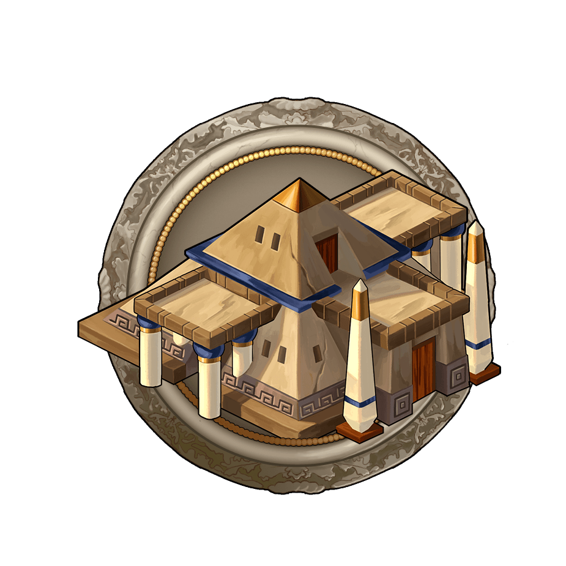
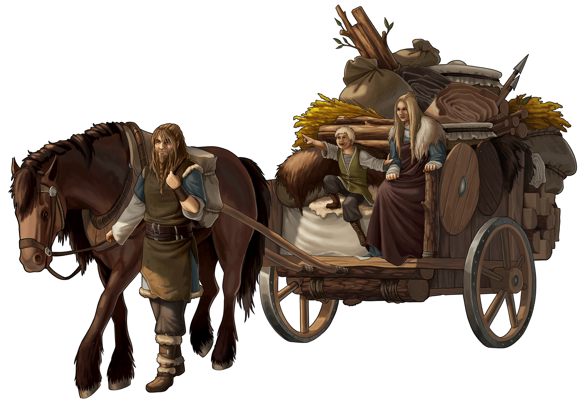
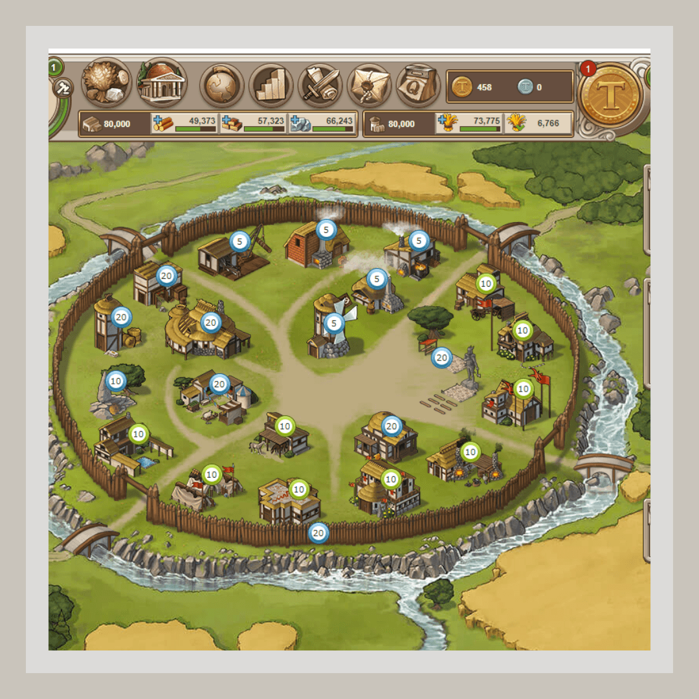

# Developing your first villages

> Source: Unofficial Travian  
> URL: https://unofficialtravian.com/2025/01/09/developing-your-first-villages/  
> Written on April 13, 2023

---

Welcome back to the Thursday Guides! Today we will look into the initial development of the villages.

It’s surprising, but almost every experienced alliance leader who recruits new members has to explain them how to develop villages so that settling a 3rd, 4th or 5th doesn’t take an unreasonable amount of time.

***Disclaimer: Prepare for a long reading!***

*This guide does not cover various developing strategies and is not aimed to be the one and only universal way to develop. **The main point of this guide is to give new players, and those who return from a long break, some guidance on how to make a viable account in the game.** In this guide we also will not cover the initial early farm or how to get more resources than your village produces, we will have a separate article for that soon. It goes without saying that if you have extra resources from farming or trading, it will increase the speed with which you develop, but it won’t change the basic principles.*

**So, let’s start our Travian journey!**

##### **I registered in the game with the tribe I picked. What’s next?**

**Settling a second village as fast as possible!**The first steps in the game are covered well enough in various guides about how to settle the second village. **Pick one guide for your gameworld speed and follow it step by step.** You can find them here: **Fast second village guides.**

Yes, none of those guides are perfect (neither is this one) and yet, following them would give on average a better result than if you’d developed yourself without exact guidance or general understanding.

***Word of Wisdom:****At this stage do not keep resources in hero inventory, use them immediately after you receive them from quests, adventures and such. Make sure your hero won’t die in adventures or while killing animals. Monitor how much health your hero loses and if needed, add a few more points to hero strength.*

##### **Why do I even need to settle my second village so fast? Is it so important?**

Yes, it’s important to build a second village fast. This allows you to pick a better spot for your future capital while others are still struggling getting the needed resources, culture points and training settlers. But even if you just want to settle near your initial (spawn) village, it’s still important to show alliances around you that your development is fast paced. Remember, Travian: Legends is an alliance game, and this will let you become a part of a more organised alliance earlier.

At this stage it would be good to look into alliances around you (you can do it through your embassy) and try to join the alliance which has the biggest presence in your surrounding area

##### **Ok, I am on the way to my second village, what’s next?**

Make sure to be online every time your new village lands to start initial buildings. Don’t keep your village empty with 2 population for long. Active farmers monitor surroundings and those undeveloped villages work as a marker for them – this player is not active, so it’s worth checking whether they can be farmed. Do not give them that impression! The more regular your population increases, the more active (and therefore dangerous) you look from the outside!

##### **Your hero is an invaluable resource that will help you a lot in early development.**

You should have the hero characteristics distributed mainly in resources, yet do not forget about some strength to keep the hero alive while doing adventures. Up to level 7 your hero only needs 2-3 points distributed in strength, all others should go to resources.

After level 7 of your hero each eighth hero point on average should go to strength. If your hero still loses too much health in adventures, consider adding a few more strength to keep health loss below 10%.

 ***Word of Wisdom:** Make your second village a new hero home, so that you won’t need to use the marketplace a lot to deliver resources into your newly settled village. It will save you some clicks and reduce waiting times for resources.*

##### **What exactly should I build and where?**

**Develop both your villages in parallel.** Use hero bag resources to develop both villages by adding resources that you still miss. Since your first village has already been developed for a while, most resources from the hero bag should go to the second one.

***Word of Wisdom:****Make sure that you have enough Warehouse and Granary capacity to cover your hours when you are not online! If you plan to go offline for let’s say 4 hours, make sure that your resources won’t overflow. In this case prioritise Warehouse and Granary capacity (but do not make them too huge) over resource development.**You can look this up in a Travian Plus village overview or by hovering over the warehouse and granary bars in the upper menu.*

**Ready to develop? Then click on the headers below to see the detailed development tables for your first villages!**

**⛏️** **The Economic development after you settled a second village.** (Click to expand text)
*The table below is based on general development strategy and Task rewards (which are different for the spawn and settled villages). Full information about available tasks you can find in a Travian Knowledgebase:*[***Task System***](https://support.travian.com/en/support/solutions/articles/7000060702-task-system)*.*

| **SPAWN village** | **SETTLED village** |
| --- | --- |
| Use your hero bag selectively to add resources that you miss – not a lot. | Use your hero bag and your hero production fully. |
| Resource and Culture Point Development | |
| All resources to 5. | One each resource to 2.All croplands to 1. Main building to 10. |
| Protect both your villages from being scouted without your notice. Smithy 3.Stables 5.Research scouts and train 10 of those. Send 5 to your second village as a reinforcement. | **All resources to 2.**Warehouse and Granary to 3.Rally Point 1.Marketplace 1.Wall 1 (CP58).**All resources to 4.**Grain Mill 1.*Optional: Cranny 10.* |
| **All resources to 6 in both villages.**Grain mill 2.Main building 14. | |
| **All resources to 7.**Grain mill 3. | Upgrade Warehouse and Granary to 7. |
| **All resources to 8.**Ideally, but not necessarily, upgrade one type fully and then move on to the next:All Clay Pits -> All Woodcutters -> All Croplands -> All Iron Mines.This way you will get access to the task rewards earlier and receive extra resources for development. | Residence (or Palace if it’s a future capital) 1.Marketplace 3, Barracks 3, Embassy 5, Academy 5, Smithy 3, Stable 3 for cheap culture points.**All resources to 7 (CP150).**Grain Mill 3.**All resources to 8.** |
| **At this stage you will more or less have 2 equally developed villages.** | |
| **Further steps need to be performed for both villages.** | |
| **Warehouse and granary to 12 (or higher).**The rules are the same. Warehouse and Granary capacity should cover your needs for offline periods. | |
| Marketplace 10, Wall 10, Embassy 10, Academy 10, Townhall 1 for cheap culture points. | |
| **Hero mansion 10.**Build Hero Mansion if there are available oases 50% crop or 25% crop+other resource and **conquer your oasis**. If there are only 25% non-crop oases around, skip this stage until you have a complete economy. No oases around – no hero mansion at all. | |
| **One of each resource fields to 10.**At this stage you can start demolishing crannies 3 to free up slots for further buildings if you built them as a part of initial settling guide. Keep only 1 of level 10 by now. | |
| **Once you upgrade a certain resource field to 10, build the respective resource building to level 3.**Woodcutter 10 -> Sawmill 3.Clay Pit 10 -> Brickyard 3.Iron Mine 10 -> Iron Foundry 3.Cropland 10 -> Grain Mill 4 and 5. Bakery 3.*Note: If your second village is a 15-cropper, upgrade all resource fields to level 10, but do not build Sawmill, Brickyard or Iron Foundry. Build only a Grain Mill and a Bakery.* | |
| **All other resource fields to 9.**(At this stage your village will produce around 250 Culture points -> See **Townhall celebrations**). | |
| **Residence (Palace) 10 in your second village.****Important note:** Monitor your culture point production in a settlement tab of your palace or residence. Do not forget to add up running or planned Townhall celebrations to that calculation. Ideally you should have a residence level 10 built and 3 settlers trained shortly before you have enough culture points for a new village. Make sure to settle another village as soon as you have the option to do that.**Train settlers in your second village.****Settle your third village.** | |
| **Main building 20.** | |
| **All resources to 10 in both villages.**All inside Resource buildings (Sawmill, Iron Foundry, Brickyard, Grain Mill, Bakery) to 5.Marketplace 20,  Stable 10, Trade office 5. | |
| **Upgrade other internal buildings to a higher level to generate culture points faster and be able to settle further villages:**Warehouse 20, Granary 20, Wall 20, Rally Point 20, Academy 20, Embassy 15, Hospital 10, Townhall 10, Barracks 10, Stables 10, Smithy 10, Trade office 10. | |
| **Townhall celebrations** | |
| It’s best to perform Townhall celebrations in every village, when this village starts producing around **250-350 Culture points**. Before that it’s best to focus strictly on the economy. | |
| **Final words of Wisdom** | |
| ***Word of Wisdom-1:** You do not have to reach all the goals above immediately. Once your economy of a certain village is fully upgraded, start supplying other villages with resources via the Marketplace to build them faster.****Word of Wisdom-2:** The order above is not “set in stone”. Upgrade cheaper and faster buildings little by little while you’re gathering resources for expensive ones. And yet, always keep in mind your general goal.****Word of Wisdom-3:** Consider building faster buildings when you are online and set longer buildings when you go offline.* | |

A fully developed ***regular resource village*** will look something like this:

**⚔️ Early Military Development** (Click to expand text)
If you do not farm, do not focus on the military or train troops too early. Economy comes first! Training troops early will “steal” scarce resources from you and will slow down your development and ability to recover from troop losses.

If needed (alliance leaders ask or you do not feel secure because of aggressive neighbours) pick which village you plan to make your initial “military base” and only upgrade military buildings in it.

**The decision when to start training will depend on the hostility of your surroundings.** It’s best if you start producing troops only once you have at least **1 fully economically developed village** (all resource fields to 10, all resource buildings to 5).

- Barracks 12 (this and further goes only to one village – your “military base”).
- Stables 10.
- Academy 15.
- Smithy 10.
- Research defensive infantry and defensive cavalry. See **“5 things to consider”** series to explore the benefits of your tribe.
- Train your first 500 units.

**Third and further resource villages development** (Click to expand text)
You can use your second village development as a base for all further resource villages as well, with a small addition, that it makes sense to prioritize the **Main building** early over the other buildings to speed up the general construction and get additional culture points production.

Bring back your hero to where your army is located, and **use the marketplace and hero bag** **resources** to supply your new village.

**Building order:**

- Main building 10.
- All resources to 2.
- Rally point 1.
- 1 cropland to 5.
- Warehouse 3.
- Granary 2.
- Marketplace 1 (to monitor deliveries).
- Residence or Command Centre for Huns 1 (to prevent conquering).
- Main building 14.
- Warehouse 8.
- Granary 3.
- Main building to 20 (upgrade for gold: 3 x 2 gold with Travian Plus).

**The Economic path here stays the same:**

All resources to 8 -> Оne of each to 10 (with respective resource buildings 3) -> All resources to 9, then 10 (all resource buildings to 5).

In between construct cheap buildings that give defence, useful abilities and cheap culture points: Rally Point, Marketplace, Wall, Barracks, Academy, Smithy, Stables, Embassy, Townhall, Trade office. Start running Townhall celebrations when your village will produce 250 Culture points.

This is development for a**resource (not producing troops, only supplying others) village**. We will talk about developing villages with specific specialisation (capital, defence, offence, spying etc) in our upcoming articles.